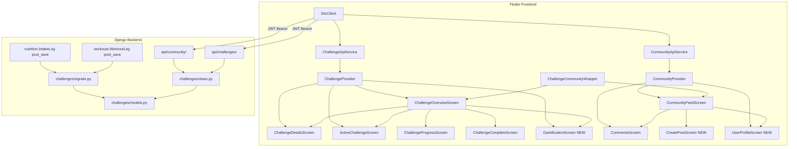

# Design Document: Challenge & Community System

## Overview

The Challenge & Community System extends NutriLift with two interconnected subsystems:

1. **Challenge & Gamification** — time-boxed fitness/nutrition challenges with automatic progress tracking via Django signals, leaderboards, badges, and streaks.
2. **Community** — a social feed with posts, likes, comments, follows, and content moderation.

The backend is a new `challenges` Django app added alongside `workouts`, `nutrition`, and `authentications`. The frontend enhances existing screens in `frontend/lib/Challenge_Community/` and adds three new screens, all using the `provider` package for state management (matching the existing subsystem pattern) and the existing `DioClient` for authenticated API calls.

Key design decisions:
- Signals in `challenges/signals.py` listen to `WorkoutLog` and `IntakeLog` post_save events from the existing apps — no changes to those apps are needed.
- The `provider` package (not Riverpod) is used for this subsystem to match the existing `StatefulWidget`/`setState` pattern in the Challenge_Community screens.
- JOIN/POST action buttons use green `#4CAF50`; all other buttons follow the app's red `#E53935` primary theme.
- UUID primary keys are used on all new models, consistent with the requirements.


## Architecture



The signal flow is unidirectional: existing app events trigger challenge progress updates without any modification to `workouts` or `nutrition` apps.


## Components and Interfaces

### Backend Components

**`challenges/models.py`** — All models for both subsystems (Challenge, ChallengeParticipant, Badge, UserBadge, Streak, Post, Comment, Like, Report, Follow).

**`challenges/serializers.py`** — DRF serializers for each model. The `ChallengeSerializer` includes a computed `participant_progress` field that queries the requesting user's `ChallengeParticipant.progress` (0 if not joined). The `PostSerializer` includes a computed `is_liked_by_me` boolean.

**`challenges/views.py`** — DRF ViewSets and APIViews:
- `ChallengeViewSet` — list active challenges, join/leave actions
- `LeaderboardView` — top-10 participants for a challenge
- `BadgeView` — user's earned badges
- `StreakView` — user's streak record
- `PostViewSet` — feed, create, delete, like, comment, report
- `UserProfileView` — profile stats
- `FollowView` — follow/unfollow toggle
- `UserPostsView` / `UserFollowersView` — user-scoped lists

**`challenges/signals.py`** — Two signal handlers:
- `handle_workout_log_saved` — listens to `workouts.WorkoutLog` post_save, updates workout/mixed challenge progress and streak
- `handle_intake_log_saved` — listens to `nutrition.IntakeLog` post_save, updates nutrition/mixed challenge progress and streak

**`challenges/urls.py`** — URL patterns for both `api/challenges/` and `api/community/` namespaces.

### Frontend Components

**`challenge_api_service.dart`** — Wraps `DioClient` for all challenge/gamification endpoints. Methods: `fetchActiveChallenges()`, `joinChallenge(id)`, `leaveChallenge(id)`, `fetchLeaderboard(id)`, `fetchBadges()`, `fetchStreak()`.

**`community_api_service.dart`** — Wraps `DioClient` for all community endpoints. Methods: `fetchFeed(page)`, `createPost(content, imageUrls)`, `deletePost(id)`, `toggleLike(id)`, `fetchComments(id)`, `addComment(id, content)`, `reportPost(id, reason)`, `fetchProfile(id)`, `toggleFollow(id)`, `fetchUserPosts(id)`, `fetchFollowers(id)`.

**`challenge_provider.dart`** — `ChangeNotifier` exposing: `List<ChallengeModel> challenges`, `bool isLoading`, `String? error`, `StreakModel? streak`, `List<BadgeModel> badges`. Methods: `fetchChallenges()`, `joinChallenge(id)`, `leaveChallenge(id)`, `fetchStreak()`, `fetchBadges()`.

**`community_provider.dart`** — `ChangeNotifier` exposing: `List<PostModel> posts`, `bool isLoading`, `String? error`, `int currentPage`, `bool hasMore`. Methods: `fetchFeed()`, `loadMore()`, `createPost(content, imageUrls)`, `toggleLike(postId)`, `addComment(postId, content)`.

### Screen Enhancement Summary

| Screen | Change |
|---|---|
| `challenge_community_wrapper.dart` | Wire `_ChallengeTabContent` to `ChallengeProvider`; replace mock data |
| `challenge_overview_screen.dart` | Add type badge chip, progress bar, remaining days, JOIN button wired to provider |
| `challenge_details_screen.dart` | Add leaderboard ListView, circular progress, LEAVE button, API data |
| `active_challenge_screen.dart` | Wire to real `ChallengeParticipant` data from provider |
| `challenge_progress_screen.dart` | Wire linear progress bar to real participant progress |
| `community_feed_screen.dart` | Real API, infinite scroll, image carousel, like toggle, FAB |
| `comments_screen.dart` | Real API, report option via 3-dot menu |
| `create_post_screen.dart` | NEW — text field + image picker + POST button |
| `user_profile_screen.dart` | NEW — avatar/stats + Follow button + Posts/Followers tabs |
| `gamification_screen.dart` | NEW — streak card + badges GridView |


## Data Models

### Backend Django Models (`challenges/models.py`)

```python
import uuid
from django.db import models
from django.conf import settings

# --- Challenge & Gamification ---

class Challenge(models.Model):
    TYPE_CHOICES = [('nutrition','Nutrition'),('workout','Workout'),('mixed','Mixed')]
    UNIT_CHOICES = [('kcal','kcal'),('reps','reps'),('days','days')]

    id = models.UUIDField(primary_key=True, default=uuid.uuid4, editable=False)
    name = models.CharField(max_length=255)
    description = models.TextField()
    challenge_type = models.CharField(max_length=20, choices=TYPE_CHOICES)
    goal_value = models.FloatField()
    unit = models.CharField(max_length=10, choices=UNIT_CHOICES)
    start_date = models.DateTimeField()
    end_date = models.DateTimeField()
    created_by = models.ForeignKey(settings.AUTH_USER_MODEL, on_delete=models.CASCADE)
    is_active = models.BooleanField(default=True)
    created_at = models.DateTimeField(auto_now_add=True)

class ChallengeParticipant(models.Model):
    id = models.UUIDField(primary_key=True, default=uuid.uuid4, editable=False)
    challenge = models.ForeignKey(Challenge, on_delete=models.CASCADE, related_name='participants')
    user = models.ForeignKey(settings.AUTH_USER_MODEL, on_delete=models.CASCADE)
    progress = models.FloatField(default=0)
    completed = models.BooleanField(default=False)
    joined_at = models.DateTimeField(auto_now_add=True)
    completed_at = models.DateTimeField(null=True, blank=True)
    rank = models.IntegerField(null=True, blank=True)
    class Meta:
        unique_together = [('challenge', 'user')]

class Badge(models.Model):
    id = models.UUIDField(primary_key=True, default=uuid.uuid4, editable=False)
    name = models.CharField(max_length=255)
    description = models.TextField()
    icon_url = models.CharField(max_length=500)
    criteria = models.JSONField()  # e.g. {"type": "challenge_complete"}
    points_reward = models.IntegerField()
    is_active = models.BooleanField(default=True)
    created_at = models.DateTimeField(auto_now_add=True)

class UserBadge(models.Model):
    id = models.UUIDField(primary_key=True, default=uuid.uuid4, editable=False)
    user = models.ForeignKey(settings.AUTH_USER_MODEL, on_delete=models.CASCADE)
    badge = models.ForeignKey(Badge, on_delete=models.CASCADE)
    earned_at = models.DateTimeField(auto_now_add=True)
    class Meta:
        unique_together = [('user', 'badge')]

class Streak(models.Model):
    id = models.UUIDField(primary_key=True, default=uuid.uuid4, editable=False)
    user = models.OneToOneField(settings.AUTH_USER_MODEL, on_delete=models.CASCADE)
    current_streak = models.IntegerField(default=0)
    longest_streak = models.IntegerField(default=0)
    last_active_date = models.DateField(null=True, blank=True)
    updated_at = models.DateTimeField(auto_now=True)

# --- Community ---

class Post(models.Model):
    id = models.UUIDField(primary_key=True, default=uuid.uuid4, editable=False)
    user = models.ForeignKey(settings.AUTH_USER_MODEL, on_delete=models.CASCADE)
    content = models.TextField(max_length=1000)
    image_urls = models.JSONField(default=list)
    like_count = models.IntegerField(default=0)
    comment_count = models.IntegerField(default=0)
    is_reported = models.BooleanField(default=False)
    is_removed = models.BooleanField(default=False)
    created_at = models.DateTimeField(auto_now_add=True)
    updated_at = models.DateTimeField(auto_now=True)

class Comment(models.Model):
    id = models.UUIDField(primary_key=True, default=uuid.uuid4, editable=False)
    post = models.ForeignKey(Post, on_delete=models.CASCADE, related_name='comments')
    user = models.ForeignKey(settings.AUTH_USER_MODEL, on_delete=models.CASCADE)
    content = models.TextField()
    created_at = models.DateTimeField(auto_now_add=True)

class Like(models.Model):
    id = models.UUIDField(primary_key=True, default=uuid.uuid4, editable=False)
    post = models.ForeignKey(Post, on_delete=models.CASCADE, related_name='likes')
    user = models.ForeignKey(settings.AUTH_USER_MODEL, on_delete=models.CASCADE)
    created_at = models.DateTimeField(auto_now_add=True)
    class Meta:
        unique_together = [('post', 'user')]

class Report(models.Model):
    STATUS_CHOICES = [('pending','Pending'),('reviewed','Reviewed'),('dismissed','Dismissed')]
    id = models.UUIDField(primary_key=True, default=uuid.uuid4, editable=False)
    post = models.ForeignKey(Post, on_delete=models.CASCADE)
    reported_by = models.ForeignKey(settings.AUTH_USER_MODEL, on_delete=models.CASCADE)
    reason = models.TextField()
    status = models.CharField(max_length=20, choices=STATUS_CHOICES, default='pending')
    created_at = models.DateTimeField(auto_now_add=True)
    reviewed_at = models.DateTimeField(null=True, blank=True)

class Follow(models.Model):
    id = models.UUIDField(primary_key=True, default=uuid.uuid4, editable=False)
    follower = models.ForeignKey(settings.AUTH_USER_MODEL, on_delete=models.CASCADE, related_name='following')
    following = models.ForeignKey(settings.AUTH_USER_MODEL, on_delete=models.CASCADE, related_name='followers')
    created_at = models.DateTimeField(auto_now_add=True)
    class Meta:
        unique_together = [('follower', 'following')]
```

### Frontend Dart Models

```dart
// In challenge_api_service.dart or a models file

class ChallengeModel {
  final String id;
  final String name;
  final String description;
  final String challengeType; // 'nutrition' | 'workout' | 'mixed'
  final double goalValue;
  final String unit;
  final DateTime startDate;
  final DateTime endDate;
  final double participantProgress; // 0 if not joined
  bool isJoined; // derived: participantProgress > 0 or explicit join state
}

class ChallengeParticipantModel {
  final int rank;
  final String userId;
  final String username;
  final String? avatarUrl;
  final double progress;
}

class BadgeModel {
  final String badgeId;
  final String name;
  final String description;
  final String iconUrl;
  final int pointsReward;
  final DateTime earnedAt;
}

class StreakModel {
  final int currentStreak;
  final int longestStreak;
  final String? lastActiveDate;
}

class PostModel {
  final String id;
  final String userId;
  final String username;
  final String? avatarUrl;
  final String content;
  final List<String> imageUrls;
  int likeCount;
  int commentCount;
  bool isLikedByMe;
  final DateTime createdAt;
}

class CommentModel {
  final String id;
  final String userId;
  final String username;
  final String? avatarUrl;
  final String content;
  final DateTime createdAt;
}

class UserProfileModel {
  final String id;
  final String username;
  final String? avatarUrl;
  final int followerCount;
  final int followingCount;
  final int postCount;
  bool isFollowingMe;
}
```


## Correctness Properties

*A property is a characteristic or behavior that should hold true across all valid executions of a system — essentially, a formal statement about what the system should do. Properties serve as the bridge between human-readable specifications and machine-verifiable correctness guarantees.*

### Property 1: Authentication Guard

*For any* endpoint in the challenges or community API, a request made without a valid JWT token should receive HTTP 401 and no data.

**Validates: Requirements 3.6, 4.3, 7.5**

---

### Property 2: Active Challenge Filter

*For any* set of Challenge records with varying `is_active` and `end_date` values, `GET /api/challenges/active/` should return only those where `is_active=True` AND `end_date` is strictly in the future — no expired or inactive challenges should appear.

**Validates: Requirements 3.1**

---

### Property 3: Join/Leave Round-Trip

*For any* authenticated user and active challenge, joining the challenge (POST join) and then leaving it (DELETE leave) should result in no `ChallengeParticipant` record existing for that user/challenge pair — the state is fully restored.

**Validates: Requirements 3.2, 3.5**

---

### Property 4: Leaderboard Ordering Invariant

*For any* challenge with participants having arbitrary progress values, `GET /api/challenges/{id}/leaderboard/` should return at most 10 entries, and for every adjacent pair of entries `(a, b)` in the result, `a.progress >= b.progress` (descending order is preserved).

**Validates: Requirements 3.4**

---

### Property 5: Signal Progress Increment

*For any* authenticated user who has joined an active challenge, saving a `WorkoutLog` (for workout/mixed challenges) or `IntakeLog` (for nutrition/mixed challenges) should result in `ChallengeParticipant.progress` being strictly greater than its value before the save, incremented by the log's calorie value.

**Validates: Requirements 5.1, 5.2, 16.1 (TC-CG01)**

---

### Property 6: Progress Completion Invariant

*For any* `ChallengeParticipant`, if `progress >= challenge.goal_value` then `completed` must be `True` and `completed_at` must be non-null. This invariant must hold after every progress update triggered by a signal.

**Validates: Requirements 5.3**

---

### Property 7: Streak Consecutive Day Increment

*For any* user, logging activity on day N and then on day N+1 (consecutive days) should result in `Streak.current_streak` being exactly 1 greater than it was after day N's log. Logging on the same day twice should leave `current_streak` unchanged.

**Validates: Requirements 5.4**

---

### Property 8: Badge Award on Challenge Completion

*For any* user who completes a challenge (progress reaches goal_value), if there exists an active `Badge` with `criteria = {"type": "challenge_complete"}` that the user has not yet earned, a `UserBadge` record should be created for that user/badge pair.

**Validates: Requirements 5.5**

---

### Property 9: Feed Filter and Ordering

*For any* set of Post records with varying `is_removed` values and `created_at` timestamps, `GET /api/community/feed/` should return only posts where `is_removed=False`, and for every adjacent pair `(a, b)` in the result, `a.created_at >= b.created_at` (descending order).

**Validates: Requirements 6.1, 7.3**

---

### Property 10: Post Content Round-Trip

*For any* valid post content string (non-empty, ≤1000 chars), creating a post via `POST /api/community/posts/` and then fetching the feed should return a post whose `content` field is identical to the submitted content — no mutation or truncation.

**Validates: Requirements 6.2, 16.2 (TC-CM01), 16.3**

---

### Property 11: Post Ownership Delete

*For any* post, only the user who created it should receive HTTP 204 on `DELETE /api/community/posts/{id}/`. Any other authenticated user should receive HTTP 403, and the post should remain in the database.

**Validates: Requirements 6.4**

---

### Property 12: Like Toggle Round-Trip

*For any* post with an initial `like_count` of N, a user liking it (POST like) and then liking it again (which toggles it off) should return `like_count` to exactly N, and `is_liked_by_me` should be `False`.

**Validates: Requirements 6.5**

---

### Property 13: Comment Count Increment

*For any* post, adding a comment via `POST /api/community/posts/{id}/comment/` should increment `Post.comment_count` by exactly 1, and the new comment should appear in `GET /api/community/posts/{id}/comments/`.

**Validates: Requirements 6.6**

---

### Property 14: Comments Ordering Invariant

*For any* post with multiple comments, `GET /api/community/posts/{id}/comments/` should return comments such that for every adjacent pair `(a, b)`, `a.created_at <= b.created_at` (ascending order — oldest first).

**Validates: Requirements 6.7**

---

### Property 15: Follow Toggle Round-Trip

*For any* pair of users (A follows B), following then unfollowing should result in no `Follow` record existing for that pair, and B's `follower_count` should return to its original value.

**Validates: Requirements 7.2**

---

### Property 16: Uniqueness Constraints

*For any* (user, badge) pair, (post, user) Like pair, or (follower, following) Follow pair, attempting to create a duplicate record should raise an integrity error — the database should never contain two records with the same constrained key combination.

**Validates: Requirements 1.4, 2.3, 2.5**


## Error Handling

### Backend

| Scenario | HTTP Status | Response |
|---|---|---|
| Unauthenticated request | 401 | `{"detail": "Authentication required"}` |
| Join already-joined challenge | 400 | `{"detail": "Already joined this challenge"}` |
| Leave challenge not joined | 404 | `{"detail": "Not found"}` |
| Post content > 1000 chars | 400 | `{"content": ["Ensure this field has no more than 1000 characters."]}` |
| Delete post not owned | 403 | `{"detail": "You do not have permission to perform this action."}` |
| Challenge not found | 404 | `{"detail": "Not found"}` |
| Signal handler exception | Logged, not raised | Progress update silently fails; logged to Django logger |

Signal handlers must be wrapped in `try/except` to prevent a `WorkoutLog` or `IntakeLog` save from failing due to a challenge progress error. Errors are logged at `ERROR` level.

### Frontend

- All API calls in `ChallengeApiService` and `CommunityApiService` catch `DioException` and rethrow as typed errors.
- `ChallengeProvider` and `CommunityProvider` set `error` string on failure and call `notifyListeners()`.
- Screens observe `provider.error` and display a `SnackBar` or inline error widget with a retry button.
- Optimistic updates (like toggle) are rolled back if the API call fails.
- Loading states use `CircularProgressIndicator` centered in the content area.


## Testing Strategy

### Dual Testing Approach

Both unit tests and property-based tests are required. Unit tests verify specific examples and integration flows (TC-CG01, TC-CM01). Property tests verify universal correctness across randomly generated inputs.

### Backend Tests (`backend/challenges/tests.py`)

**Property-Based Testing Library**: `hypothesis` with `hypothesis-django` (same pattern as existing nutrition tests in the codebase).

Each property test runs a minimum of 100 iterations via `@settings(max_examples=100)`.

**Unit / Integration Tests (specific examples)**:

- TC-CG01: Create user → create challenge (workout type) → join challenge → save WorkoutLog with calories_burned=500 → assert `ChallengeParticipant.progress == 500`
- TC-CM01: Create user → POST `/api/community/posts/` with content "hello" → GET `/api/community/feed/` → assert response contains post with matching `id`
- Duplicate join returns 400
- Delete post as non-owner returns 403
- Streak resets when gap > 1 day

**Property-Based Tests**:

Each test is tagged with a comment referencing the design property it validates.

```python
# Feature: challenge-community-system, Property 2: Active challenge filter
@given(challenges=st.lists(challenge_strategy(), min_size=1, max_size=20))
@settings(max_examples=100)
def test_active_challenge_filter(self, challenges):
    # Only is_active=True and end_date in future should appear in response

# Feature: challenge-community-system, Property 5: Signal progress increment
@given(calories=st.floats(min_value=1.0, max_value=5000.0))
@settings(max_examples=100)
def test_signal_increments_progress(self, calories):
    # WorkoutLog save with calories_burned=calories → participant.progress increases by calories

# Feature: challenge-community-system, Property 9: Feed filter and ordering
@given(posts=st.lists(post_strategy(), min_size=2, max_size=30))
@settings(max_examples=100)
def test_feed_excludes_removed_and_is_ordered(self, posts):
    # No is_removed posts in feed; adjacent pairs satisfy a.created_at >= b.created_at

# Feature: challenge-community-system, Property 10: Post content round-trip
@given(content=st.text(min_size=1, max_size=1000).filter(lambda s: s.strip()))
@settings(max_examples=100)
def test_post_content_round_trip(self, content):
    # Create post with content → fetch feed → returned content == original content

# Feature: challenge-community-system, Property 12: Like toggle round-trip
@given(initial_likes=st.integers(min_value=0, max_value=100))
@settings(max_examples=100)
def test_like_toggle_round_trip(self, initial_likes):
    # Like then unlike → like_count returns to initial value

# Feature: challenge-community-system, Property 4: Leaderboard ordering
@given(participants=st.lists(participant_strategy(), min_size=1, max_size=50))
@settings(max_examples=100)
def test_leaderboard_ordering_and_limit(self, participants):
    # Result length <= 10; adjacent pairs satisfy a.progress >= b.progress

# Feature: challenge-community-system, Property 16: Uniqueness constraints
@given(st.data())
@settings(max_examples=100)
def test_duplicate_like_raises_integrity_error(self, data):
    # Creating two Like records for same (post, user) raises IntegrityError
```

### Frontend Tests

Flutter widget tests use `mockito` to mock `ChallengeApiService` and `CommunityApiService`.

- `ChallengeProvider` unit tests: verify `joinChallenge` updates the matching challenge in `challenges` list without full refresh (Property 3 analog in state layer)
- `CommunityProvider` unit tests: verify `toggleLike` optimistically updates `like_count` and `is_liked_by_me` before API resolves (Property 12 analog)
- Widget tests for `ChallengeOverviewScreen`: verify `CircularProgressIndicator` shown during load, error widget shown on failure, JOIN button triggers `joinChallenge`
- Widget tests for `CommunityFeedScreen`: verify FAB navigates to `CreatePostScreen`, like button toggles icon state


---

## Daily Log Feature (Requirements 18–25)

### Overview

The daily log feature adds per-day task tracking and media attachment to active challenges. Each participant gets one `ChallengeDailyLog` per calendar day. On completion, an optional share flow auto-creates a community post. The frontend replaces the static info card in `ActiveChallengeScreen` with a live daily log UI.

---

### Architecture Addition

```mermaid
graph TD
    subgraph Flutter Frontend - Daily Log
        AC[ActiveChallengeScreen] --> DL[Daily Log UI]
        DL --> CP2[ChallengeProvider]
        CP2 --> CAS[ChallengeApiService]
        DL --> DC[DayCompletionOverlay]
        DC --> CAS
    end

    subgraph Django Backend - Daily Log
        DLURL[api/challenges/{id}/daily-log/] --> DLV[DailyLogView]
        DLSURL[api/challenges/{id}/daily-logs/] --> DLV
        DLV --> DLM[ChallengeDailyLog model]
        DLV --> PM[Post model - share flow]
    end

    CAS -->|JWT Bearer| DLURL
    CAS -->|JWT Bearer| DLSURL
```

---

### New Backend Components

**`DailyLogView`** — handles `GET`, `PATCH`, and `POST complete/` for today's log. On `GET`, uses `get_or_create` with `day_number` computed as `(today - participant.joined_at.date()).days + 1`. On `POST complete/` with `share_to_community: true`, creates a `Post` and returns it under `shared_post`.

**`DailyLogListView`** — handles `GET /api/challenges/{id}/daily-logs/` returning all logs for the participant ordered by `day_number` ascending.

**New URL patterns** added to `challenges/urls.py`:
```
GET  /api/challenges/{id}/daily-log/          → DailyLogView
PATCH /api/challenges/{id}/daily-log/         → DailyLogView
POST /api/challenges/{id}/daily-log/complete/ → DailyLogCompleteView
GET  /api/challenges/{id}/daily-logs/         → DailyLogListView
```

**`ChallengeDailyLogSerializer`** — serializes all fields including nested `task_items` and `media_urls` JSON arrays. The `complete/` response serializer adds an optional `shared_post` field using the existing `PostSerializer`.

### New Frontend Components

**`ChallengeApiService` additions**:
- `fetchTodayLog(challengeId)` → `ChallengeDailyLogModel`
- `updateDailyLog(challengeId, taskItems, mediaUrls)` → `ChallengeDailyLogModel`
- `completeDailyLog(challengeId, {shareToCommmunity: false})` → `{log: ChallengeDailyLogModel, sharedPost?: PostModel}`
- `fetchAllDailyLogs(challengeId)` → `List<ChallengeDailyLogModel>`

**`ChallengeProvider` additions**:
- `ChallengeDailyLogModel? todayLog`
- `bool isDailyLogLoading`
- `fetchTodayLog(challengeId)` — calls API, sets `todayLog`, notifies
- `toggleTask(challengeId, taskIndex)` — flips `task_items[index].completed`, calls `updateDailyLog`, notifies
- `attachMedia(challengeId, url, isVideo)` — appends to `todayLog.mediaUrls`, calls `updateDailyLog`, notifies
- `removeMedia(challengeId, index)` — removes from `todayLog.mediaUrls`, calls `updateDailyLog`, notifies
- `completeDailyLog(challengeId, {shareToCommmunity: false})` — calls complete endpoint, updates `todayLog`, notifies

**`ActiveChallengeScreen` enhancement** — replaces static info card with:
- Day heading: `"Day X"` (large bold text, sourced from `todayLog.dayNumber`)
- Task checklist: `CheckboxListTile` per `task_items` entry, wired to `provider.toggleTask`
- Media row: horizontal `ListView` of thumbnails + add button (camera icon bottom sheet)
- `"Complete Day X"` `ElevatedButton` enabled when all tasks checked OR `task_items` is empty
- On completion: transitions to `DayCompletionOverlay`

**`DayCompletionOverlay`** (new widget/screen) — full-screen celebration:
- Success animation + `"Day X Complete!"` heading
- Preview of auto-generated post content + first media thumbnail
- `"Share to Community"` button → calls `completeDailyLog(shareToCommmunity: true)`, shows `SnackBar("Posted to community!")`
- `"Skip"` button → dismisses overlay, returns to `ActiveChallengeScreen`
- Loading indicator on share button while API call is in progress

### Updated Screen Enhancement Table

| Screen | Change |
|---|---|
| `challenge_community_wrapper.dart` | Wire `_ChallengeTabContent` to `ChallengeProvider`; replace mock data |
| `challenge_overview_screen.dart` | Add type badge chip, progress bar, remaining days, JOIN button wired to provider |
| `challenge_details_screen.dart` | Add leaderboard ListView, circular progress, LEAVE button, API data |
| `active_challenge_screen.dart` | Replace static card with daily log UI: day heading, task checklist, media row, Complete button, DayCompletionOverlay |
| `challenge_progress_screen.dart` | Wire linear progress bar to real participant progress |
| `community_feed_screen.dart` | Real API, infinite scroll, image carousel, like toggle, FAB |
| `comments_screen.dart` | Real API, report option via 3-dot menu |
| `create_post_screen.dart` | NEW — text field + image picker + POST button |
| `user_profile_screen.dart` | NEW — avatar/stats + Follow button + Posts/Followers tabs |
| `gamification_screen.dart` | NEW — streak card + badges GridView |

---

### Data Models Addition

#### Backend: `ChallengeDailyLog` (`challenges/models.py`)

```python
class ChallengeDailyLog(models.Model):
    id = models.UUIDField(primary_key=True, default=uuid.uuid4, editable=False)
    participant = models.ForeignKey(
        ChallengeParticipant, on_delete=models.CASCADE, related_name='daily_logs'
    )
    day_number = models.PositiveIntegerField()
    # [{"label": str, "completed": bool}]
    task_items = models.JSONField(default=list)
    # [{"url": str, "is_video": bool}]
    media_urls = models.JSONField(default=list)
    is_complete = models.BooleanField(default=False)
    completed_at = models.DateTimeField(null=True, blank=True)
    created_at = models.DateTimeField(auto_now_add=True)
    updated_at = models.DateTimeField(auto_now=True)

    class Meta:
        unique_together = [('participant', 'day_number')]
```

Day number calculation (used in `DailyLogView.get_or_create`):
```python
from django.utils import timezone
today = timezone.now().date()
day_number = (today - participant.joined_at.date()).days + 1
```

#### Backend: `Challenge` model addition

```python
# Added to existing Challenge model
default_tasks = models.JSONField(default=list)  # [{"label": str}]
```

When a `ChallengeDailyLog` is created via `get_or_create`, `task_items` is populated from `challenge.default_tasks` by adding `"completed": False` to each entry. If `default_tasks` is empty, `task_items` is an empty list.

#### Frontend Dart Models

```dart
class DailyTaskItem {
  final String label;
  bool completed;

  DailyTaskItem({required this.label, required this.completed});

  factory DailyTaskItem.fromJson(Map<String, dynamic> json) =>
      DailyTaskItem(label: json['label'], completed: json['completed']);

  Map<String, dynamic> toJson() => {'label': label, 'completed': completed};
}

class DailyMediaItem {
  final String url;
  final bool isVideo;

  DailyMediaItem({required this.url, required this.isVideo});

  factory DailyMediaItem.fromJson(Map<String, dynamic> json) =>
      DailyMediaItem(url: json['url'], isVideo: json['is_video']);

  Map<String, dynamic> toJson() => {'url': url, 'is_video': isVideo};
}

class ChallengeDailyLogModel {
  final String id;
  final int dayNumber;
  final List<DailyTaskItem> taskItems;
  final List<DailyMediaItem> mediaUrls;
  final bool isComplete;
  final DateTime? completedAt;

  ChallengeDailyLogModel({
    required this.id,
    required this.dayNumber,
    required this.taskItems,
    required this.mediaUrls,
    required this.isComplete,
    this.completedAt,
  });

  factory ChallengeDailyLogModel.fromJson(Map<String, dynamic> json) =>
      ChallengeDailyLogModel(
        id: json['id'],
        dayNumber: json['day_number'],
        taskItems: (json['task_items'] as List)
            .map((e) => DailyTaskItem.fromJson(e))
            .toList(),
        mediaUrls: (json['media_urls'] as List)
            .map((e) => DailyMediaItem.fromJson(e))
            .toList(),
        isComplete: json['is_complete'],
        completedAt: json['completed_at'] != null
            ? DateTime.parse(json['completed_at'])
            : null,
      );
}
```

---

### New Correctness Properties (Properties 17–21)

*These properties extend the existing correctness properties (1–16) for the daily log feature.*

### Property 17: Daily Log Round-Trip

*For any* participant and any valid `task_items` and `media_urls` payload sent via `PATCH /api/challenges/{id}/daily-log/`, a subsequent `GET /api/challenges/{id}/daily-log/` should return `task_items` and `media_urls` arrays that are structurally equal to the last-written values — no mutation, reordering, or data loss.

**Validates: Requirements 19.2, 25.1**

---

### Property 18: Idempotent PATCH

*For any* participant and any valid `task_items`/`media_urls` payload, applying `PATCH /api/challenges/{id}/daily-log/` with the same payload N times (N ≥ 1) should produce the same final `task_items` and `media_urls` state as applying it once — repeated patches with identical data are idempotent.

**Validates: Requirements 25.2**

---

### Property 19: Day Number Invariant

*For any* `ChallengeParticipant` whose `joined_at` is in the past or present, the computed `day_number` for today's log must satisfy `day_number >= 1`. Specifically, `day_number = (today - joined_at.date()).days + 1`, so the minimum value (when `joined_at` is today) is exactly 1.

**Validates: Requirements 18.3, 25.3**

---

### Property 20: Completed Log Invariant

*For any* `ChallengeDailyLog` where `is_complete = True`, the `completed_at` field must be non-null and `completed_at >= created_at`. This invariant must hold for all logs regardless of when or how they were completed.

**Validates: Requirements 19.3, 25.4**

---

### Property 21: No Duplicate Day Numbers Per Participant

*For any* participant, `GET /api/challenges/{id}/daily-logs/` must return a list ordered by ascending `day_number` where every `day_number` value is unique — no two logs for the same participant may share a `day_number`. This is enforced by the `unique_together = [('participant', 'day_number')]` constraint and must be reflected in all API responses.

**Validates: Requirements 19.5, 25.5**

---

### Daily Log Error Handling

| Scenario | HTTP Status | Response |
|---|---|---|
| Daily log endpoint, user not joined challenge | 404 | `{"detail": "Not found"}` |
| POST complete/ on already-complete log | 400 | `{"detail": "Today's log is already complete"}` |
| PATCH with invalid task_items structure | 400 | `{"task_items": ["Invalid format"]}` |
| share_to_community=true, post creation fails | 500 | Log error; return completed log without shared_post |
| Unauthenticated daily log request | 401 | `{"detail": "Authentication required"}` |

---

### Daily Log Testing Strategy

**Property-Based Tests** (added to `backend/challenges/tests.py`, using `hypothesis`):

```python
# Feature: challenge-community-system, Property 17: Daily log round-trip
@given(
    task_items=st.lists(
        st.fixed_dictionaries({'label': st.text(min_size=1, max_size=100), 'completed': st.booleans()}),
        max_size=10
    ),
    media_urls=st.lists(
        st.fixed_dictionaries({'url': st.text(min_size=1, max_size=500), 'is_video': st.booleans()}),
        max_size=5
    )
)
@settings(max_examples=100)
def test_daily_log_round_trip(self, task_items, media_urls):
    # PATCH with task_items/media_urls → GET → returned values == written values

# Feature: challenge-community-system, Property 18: Idempotent PATCH
@given(
    task_items=st.lists(
        st.fixed_dictionaries({'label': st.text(min_size=1), 'completed': st.booleans()}),
        max_size=10
    ),
    n=st.integers(min_value=2, max_value=5)
)
@settings(max_examples=100)
def test_patch_idempotent(self, task_items, n):
    # Apply same PATCH n times → final state == state after first PATCH

# Feature: challenge-community-system, Property 19: Day number invariant
@given(days_ago=st.integers(min_value=0, max_value=365))
@settings(max_examples=100)
def test_day_number_invariant(self, days_ago):
    # joined_at = today - days_ago → day_number == days_ago + 1 >= 1

# Feature: challenge-community-system, Property 20: Completed log invariant
@given(st.data())
@settings(max_examples=100)
def test_completed_log_invariant(self, data):
    # After POST complete/ → is_complete=True, completed_at non-null, completed_at >= created_at

# Feature: challenge-community-system, Property 21: No duplicate day numbers
@given(day_count=st.integers(min_value=1, max_value=10))
@settings(max_examples=100)
def test_no_duplicate_day_numbers(self, day_count):
    # Create day_count logs for one participant → GET /daily-logs/ → all day_numbers unique, ordered ascending
```

**Unit Tests** (specific examples):

- TC-DL01: Join challenge → GET `/daily-log/` → returns log with `day_number=1`, `task_items` matching `challenge.default_tasks`
- TC-DL02: PATCH task_items → GET → returned task_items match patched values
- TC-DL03: POST `complete/` → `is_complete=True`, `completed_at` non-null
- TC-DL04: POST `complete/` twice → second call returns HTTP 400
- TC-DL05: POST `complete/` with `share_to_community=true` → `Post` created with correct content, response contains `shared_post`
- TC-DL06: POST `complete/` with `share_to_community=false` → no new `Post` created
- TC-DL07: Request to `/daily-log/` for unjoined challenge → HTTP 404
