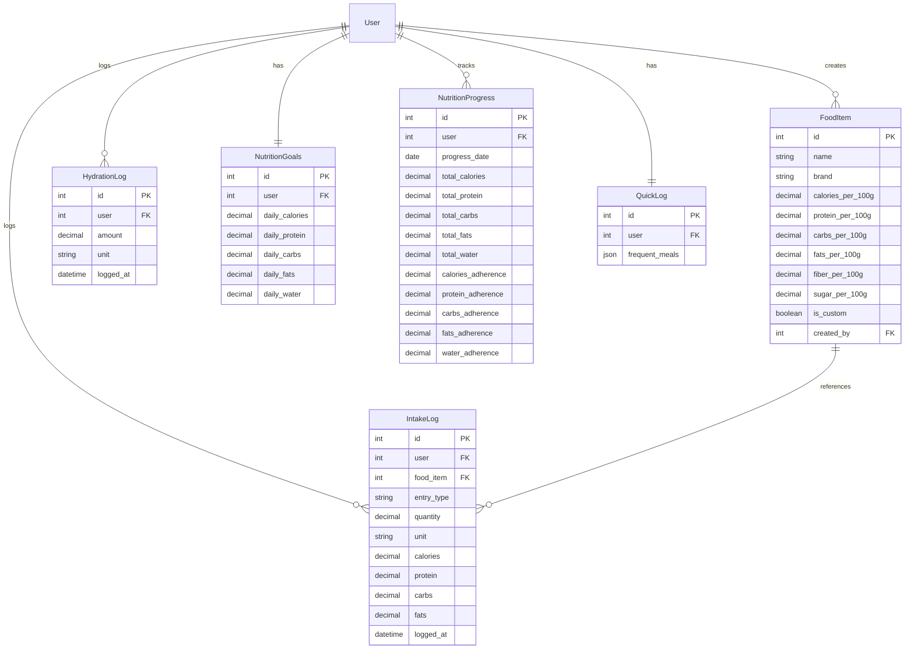

# Design Document: Nutrition Tracking Backend Integration

## Overview

The Nutrition Tracking Backend Integration implements a Django REST Framework backend for the NutriLift app's nutrition tracking functionality. The system follows the exact architectural patterns established by the existing workout tracking module (`backend/workouts/`), ensuring consistency in authentication, error handling, and API design.

The backend serves a completed Flutter frontend that provides date navigation, macro tracking, meal logging, food search, custom food entry, and visualization features. The implementation focuses on six core entities: FOOD_ITEM, INTAKE_LOG, HYDRATION_LOG, NUTRITION_GOALS, QUICK_LOG, and NUTRITION_PROGRESS.

### Key Design Principles

1. **Pattern Consistency**: Mirror the workout module's structure for models, serializers, views, and URL patterns
2. **Automatic Aggregation**: Use Django signals to automatically update NUTRITION_PROGRESS when meals are logged
3. **Calculation Accuracy**: Implement nutrient calculations using the formula: (nutrient_per_100g ÷ 100) × quantity
4. **Integration Ready**: Provide hooks for Challenge, Streak, and Wellness systems
5. **Performance First**: Use pre-aggregated data and database indexes for fast API responses

## Architecture

### Module Structure

Following the workout module pattern:

```
backend/nutrition/
├── __init__.py
├── apps.py                    # App configuration with signal registration
├── models.py                  # 6 core models
├── serializers.py             # DRF serializers with validation
├── views.py                   # ViewSets for REST API
├── urls.py                    # URL routing
├── signals.py                 # Post-save handlers for progress updates
├── admin.py                   # Django admin configuration
├── migrations/
│   └── 0001_initial.py       # Initial schema migration
└── tests/
    ├── test_models.py
    ├── test_serializers.py
    ├── test_views.py
    ├── test_signals.py
    └── test_properties.py     # Property-based tests
```

### Technology Stack

- **Framework**: Django REST Framework (already configured)
- **Database**: PostgreSQL (already configured)
- **Authentication**: JWT tokens (reuse workout module's auth)
- **Serialization**: DRF serializers with field-level validation
- **Signals**: Django signals for automatic progress updates

### Integration Points

1. **Authentication**: Reuse `backend/workouts/` JWT authentication middleware
2. **Challenge System**: Emit signals when nutrition goals are met
3. **Streak System**: Update streaks when users log nutrition on new dates
4. **Wellness System**: Provide adherence percentages for wellness score calculation

## Components and Interfaces

### 1. Models (models.py)

#### FoodItem Model

Stores nutritional information per 100g for both system and custom foods.

```python
class FoodItem(models.Model):
    name = models.CharField(max_length=255)
    brand = models.CharField(max_length=255, blank=True, null=True)
    
    # Nutritional values per 100g
    calories_per_100g = models.DecimalField(max_digits=7, decimal_places=2, validators=[MinValueValidator(0.0)])
    protein_per_100g = models.DecimalField(max_digits=6, decimal_places=2, validators=[MinValueValidator(0.0)])
    carbs_per_100g = models.DecimalField(max_digits=6, decimal_places=2, validators=[MinValueValidator(0.0)])
    fats_per_100g = models.DecimalField(max_digits=6, decimal_places=2, validators=[MinValueValidator(0.0)])
    fiber_per_100g = models.DecimalField(max_digits=6, decimal_places=2, validators=[MinValueValidator(0.0)], default=0.0)
    sugar_per_100g = models.DecimalField(max_digits=6, decimal_places=2, validators=[MinValueValidator(0.0)], default=0.0)
    
    # Custom food tracking
    is_custom = models.BooleanField(default=False, db_index=True)
    created_by = models.ForeignKey(settings.AUTH_USER_MODEL, on_delete=models.CASCADE, null=True, blank=True, related_name='custom_foods')
    
    created_at = models.DateTimeField(auto_now_add=True)
    updated_at = models.DateTimeField(auto_now=True)
    
    class Meta:
        db_table = 'food_items'
        ordering = ['name']
        indexes = [
            models.Index(fields=['name']),
            models.Index(fields=['is_custom', 'created_by']),
        ]
```

#### IntakeLog Model

Records individual meal/snack/drink entries with calculated macros.

```python
class IntakeLog(models.Model):
    ENTRY_TYPE_CHOICES = [
        ('meal', 'Meal'),
        ('snack', 'Snack'),
        ('drink', 'Drink'),
    ]
    
    user = models.ForeignKey(settings.AUTH_USER_MODEL, on_delete=models.CASCADE, related_name='intake_logs')
    food_item = models.ForeignKey(FoodItem, on_delete=models.CASCADE, related_name='intake_logs')
    
    entry_type = models.CharField(max_length=10, choices=ENTRY_TYPE_CHOICES)
    description = models.CharField(max_length=500, blank=True, null=True)
    quantity = models.DecimalField(max_digits=8, decimal_places=2, validators=[MinValueValidator(0.01)])
    unit = models.CharField(max_length=20)  # g, ml, oz, cup, etc.
    
    # Calculated macros (stored for performance)
    calories = models.DecimalField(max_digits=7, decimal_places=2)
    protein = models.DecimalField(max_digits=6, decimal_places=2)
    carbs = models.DecimalField(max_digits=6, decimal_places=2)
    fats = models.DecimalField(max_digits=6, decimal_places=2)
    
    logged_at = models.DateTimeField(default=timezone.now)
    created_at = models.DateTimeField(auto_now_add=True)
    updated_at = models.DateTimeField(auto_now=True)
    
    class Meta:
        db_table = 'intake_logs'
        ordering = ['-logged_at']
        indexes = [
            models.Index(fields=['user', '-logged_at']),
            models.Index(fields=['user', 'logged_at']),  # For date range queries
        ]
```

#### HydrationLog Model

Tracks water intake throughout the day.

```python
class HydrationLog(models.Model):
    user = models.ForeignKey(settings.AUTH_USER_MODEL, on_delete=models.CASCADE, related_name='hydration_logs')
    amount = models.DecimalField(max_digits=6, decimal_places=2, validators=[MinValueValidator(0.01)])
    unit = models.CharField(max_length=10, default='ml')  # ml, oz, cup
    
    logged_at = models.DateTimeField(default=timezone.now)
    created_at = models.DateTimeField(auto_now_add=True)
    
    class Meta:
        db_table = 'hydration_logs'
        ordering = ['-logged_at']
        indexes = [
            models.Index(fields=['user', '-logged_at']),
        ]
```

#### NutritionGoals Model

Stores daily nutrition targets per user (one record per user).

```python
class NutritionGoals(models.Model):
    user = models.OneToOneField(settings.AUTH_USER_MODEL, on_delete=models.CASCADE, related_name='nutrition_goals')
    
    daily_calories = models.DecimalField(max_digits=6, decimal_places=2, validators=[MinValueValidator(0.0)], default=2000)
    daily_protein = models.DecimalField(max_digits=6, decimal_places=2, validators=[MinValueValidator(0.0)], default=150)
    daily_carbs = models.DecimalField(max_digits=6, decimal_places=2, validators=[MinValueValidator(0.0)], default=200)
    daily_fats = models.DecimalField(max_digits=6, decimal_places=2, validators=[MinValueValidator(0.0)], default=65)
    daily_water = models.DecimalField(max_digits=6, decimal_places=2, validators=[MinValueValidator(0.0)], default=2000)  # ml
    
    created_at = models.DateTimeField(auto_now_add=True)
    updated_at = models.DateTimeField(auto_now=True)
    
    class Meta:
        db_table = 'nutrition_goals'
```

#### NutritionProgress Model

Pre-aggregated daily totals and adherence percentages.

```python
class NutritionProgress(models.Model):
    user = models.ForeignKey(settings.AUTH_USER_MODEL, on_delete=models.CASCADE, related_name='nutrition_progress')
    progress_date = models.DateField()
    
    # Aggregated totals
    total_calories = models.DecimalField(max_digits=7, decimal_places=2, default=0.0)
    total_protein = models.DecimalField(max_digits=6, decimal_places=2, default=0.0)
    total_carbs = models.DecimalField(max_digits=6, decimal_places=2, default=0.0)
    total_fats = models.DecimalField(max_digits=6, decimal_places=2, default=0.0)
    total_water = models.DecimalField(max_digits=7, decimal_places=2, default=0.0)
    
    # Adherence percentages
    calories_adherence = models.DecimalField(max_digits=5, decimal_places=2, default=0.0)
    protein_adherence = models.DecimalField(max_digits=5, decimal_places=2, default=0.0)
    carbs_adherence = models.DecimalField(max_digits=5, decimal_places=2, default=0.0)
    fats_adherence = models.DecimalField(max_digits=5, decimal_places=2, default=0.0)
    water_adherence = models.DecimalField(max_digits=5, decimal_places=2, default=0.0)
    
    updated_at = models.DateTimeField(auto_now=True)
    
    class Meta:
        db_table = 'nutrition_progress'
        ordering = ['-progress_date']
        unique_together = ['user', 'progress_date']
        indexes = [
            models.Index(fields=['user', '-progress_date']),
        ]
```

#### QuickLog Model

Maintains frequent meals for quick access (JSON field for flexibility).

```python
class QuickLog(models.Model):
    user = models.OneToOneField(settings.AUTH_USER_MODEL, on_delete=models.CASCADE, related_name='quick_log')
    
    # JSON structure: [{"food_item_id": 123, "usage_count": 45, "last_used": "2024-01-15T10:30:00Z"}, ...]
    frequent_meals = models.JSONField(default=list)
    
    updated_at = models.DateTimeField(auto_now=True)
    
    class Meta:
        db_table = 'quick_logs'
```

### 2. Serializers (serializers.py)

Following the workout module's validation patterns:

#### FoodItemSerializer

```python
class FoodItemSerializer(serializers.ModelSerializer):
    class Meta:
        model = FoodItem
        fields = [
            'id', 'name', 'brand',
            'calories_per_100g', 'protein_per_100g', 'carbs_per_100g', 
            'fats_per_100g', 'fiber_per_100g', 'sugar_per_100g',
            'is_custom', 'created_by', 'created_at', 'updated_at'
        ]
        read_only_fields = ['id', 'created_by', 'created_at', 'updated_at']
    
    def validate_name(self, value):
        """Sanitize food name (reuse workout module's sanitize_text_input)"""
        return sanitize_text_input(value)
    
    def validate(self, data):
        """Ensure all nutritional values are non-negative"""
        nutritional_fields = ['calories_per_100g', 'protein_per_100g', 'carbs_per_100g', 
                             'fats_per_100g', 'fiber_per_100g', 'sugar_per_100g']
        for field in nutritional_fields:
            if field in data and data[field] < 0:
                raise serializers.ValidationError({field: "Must be non-negative"})
        return data
```

#### IntakeLogSerializer

```python
class IntakeLogSerializer(serializers.ModelSerializer):
    food_item_details = FoodItemSerializer(source='food_item', read_only=True)
    
    class Meta:
        model = IntakeLog
        fields = [
            'id', 'user', 'food_item', 'food_item_details',
            'entry_type', 'description', 'quantity', 'unit',
            'calories', 'protein', 'carbs', 'fats',
            'logged_at', 'created_at', 'updated_at'
        ]
        read_only_fields = ['id', 'calories', 'protein', 'carbs', 'fats', 'created_at', 'updated_at']
    
    def validate_quantity(self, value):
        """Ensure quantity is positive"""
        if value <= 0:
            raise serializers.ValidationError("Quantity must be greater than zero")
        return value
    
    def validate_entry_type(self, value):
        """Ensure entry_type is valid"""
        valid_types = ['meal', 'snack', 'drink']
        if value not in valid_types:
            raise serializers.ValidationError(f"Must be one of: {', '.join(valid_types)}")
        return value
    
    def create(self, validated_data):
        """Calculate macros before saving"""
        food_item = validated_data['food_item']
        quantity = validated_data['quantity']
        
        # Calculate macros: (nutrient_per_100g ÷ 100) × quantity
        multiplier = quantity / 100
        validated_data['calories'] = food_item.calories_per_100g * multiplier
        validated_data['protein'] = food_item.protein_per_100g * multiplier
        validated_data['carbs'] = food_item.carbs_per_100g * multiplier
        validated_data['fats'] = food_item.fats_per_100g * multiplier
        
        return super().create(validated_data)
```

#### NutritionProgressSerializer

```python
class NutritionProgressSerializer(serializers.ModelSerializer):
    class Meta:
        model = NutritionProgress
        fields = [
            'id', 'user', 'progress_date',
            'total_calories', 'total_protein', 'total_carbs', 'total_fats', 'total_water',
            'calories_adherence', 'protein_adherence', 'carbs_adherence', 
            'fats_adherence', 'water_adherence',
            'updated_at'
        ]
        read_only_fields = ['id', 'updated_at']
```

### 3. Views (views.py)

Following the workout module's ViewSet patterns:

```python
class FoodItemViewSet(viewsets.ModelViewSet):
    """
    ViewSet for FoodItem CRUD operations.
    Supports search, filtering by custom/system foods.
    """
    serializer_class = FoodItemSerializer
    permission_classes = [IsAuthenticated]
    filter_backends = [filters.SearchFilter, filters.OrderingFilter]
    search_fields = ['name', 'brand']
    ordering_fields = ['name', 'created_at']
    
    def get_queryset(self):
        """Return system foods + user's custom foods"""
        user = self.request.user
        return FoodItem.objects.filter(
            models.Q(is_custom=False) | models.Q(created_by=user)
        )
    
    def perform_create(self, serializer):
        """Set created_by to current user for custom foods"""
        serializer.save(created_by=self.request.user, is_custom=True)

class IntakeLogViewSet(viewsets.ModelViewSet):
    """
    ViewSet for IntakeLog CRUD operations.
    Supports date range filtering.
    """
    serializer_class = IntakeLogSerializer
    permission_classes = [IsAuthenticated]
    
    def get_queryset(self):
        """Filter by user and optional date range"""
        user = self.request.user
        queryset = IntakeLog.objects.filter(user=user).select_related('food_item')
        
        # Date filtering
        date_from = self.request.query_params.get('date_from')
        date_to = self.request.query_params.get('date_to')
        
        if date_from:
            queryset = queryset.filter(logged_at__date__gte=date_from)
        if date_to:
            queryset = queryset.filter(logged_at__date__lte=date_to)
        
        return queryset
    
    def perform_create(self, serializer):
        """Set user to current user"""
        serializer.save(user=self.request.user)

class NutritionProgressViewSet(viewsets.ReadOnlyModelViewSet):
    """
    Read-only ViewSet for NutritionProgress.
    Progress is automatically updated via signals.
    """
    serializer_class = NutritionProgressSerializer
    permission_classes = [IsAuthenticated]
    
    def get_queryset(self):
        """Filter by user and optional date range"""
        user = self.request.user
        queryset = NutritionProgress.objects.filter(user=user)
        
        date_from = self.request.query_params.get('date_from')
        date_to = self.request.query_params.get('date_to')
        
        if date_from:
            queryset = queryset.filter(progress_date__gte=date_from)
        if date_to:
            queryset = queryset.filter(progress_date__lte=date_to)
        
        return queryset
```

### 4. Signals (signals.py)

Automatic progress updates following the workout module's signal pattern:

```python
from django.db.models.signals import post_save, post_delete
from django.dispatch import receiver
from django.db.models import Sum
from decimal import Decimal

@receiver(post_save, sender=IntakeLog)
def update_nutrition_progress_on_save(sender, instance, created, **kwargs):
    """
    Update NutritionProgress when IntakeLog is created or updated.
    Aggregates all intake logs for the date and calculates adherence.
    """
    user = instance.user
    date = instance.logged_at.date()
    
    # Aggregate all intake logs for this date
    daily_totals = IntakeLog.objects.filter(
        user=user,
        logged_at__date=date
    ).aggregate(
        total_calories=Sum('calories'),
        total_protein=Sum('protein'),
        total_carbs=Sum('carbs'),
        total_fats=Sum('fats')
    )
    
    # Aggregate hydration for this date
    daily_water = HydrationLog.objects.filter(
        user=user,
        logged_at__date=date
    ).aggregate(total_water=Sum('amount'))['total_water'] or Decimal('0.0')
    
    # Get user's goals
    try:
        goals = user.nutrition_goals
    except NutritionGoals.DoesNotExist:
        # Use default goals
        goals = NutritionGoals(
            daily_calories=2000, daily_protein=150, 
            daily_carbs=200, daily_fats=65, daily_water=2000
        )
    
    # Calculate adherence percentages
    def calc_adherence(actual, target):
        if target == 0:
            return Decimal('0.0')
        return (actual / target) * 100
    
    # Update or create progress record
    progress, _ = NutritionProgress.objects.update_or_create(
        user=user,
        progress_date=date,
        defaults={
            'total_calories': daily_totals['total_calories'] or Decimal('0.0'),
            'total_protein': daily_totals['total_protein'] or Decimal('0.0'),
            'total_carbs': daily_totals['total_carbs'] or Decimal('0.0'),
            'total_fats': daily_totals['total_fats'] or Decimal('0.0'),
            'total_water': daily_water,
            'calories_adherence': calc_adherence(daily_totals['total_calories'] or 0, goals.daily_calories),
            'protein_adherence': calc_adherence(daily_totals['total_protein'] or 0, goals.daily_protein),
            'carbs_adherence': calc_adherence(daily_totals['total_carbs'] or 0, goals.daily_carbs),
            'fats_adherence': calc_adherence(daily_totals['total_fats'] or 0, goals.daily_fats),
            'water_adherence': calc_adherence(daily_water, goals.daily_water),
        }
    )

@receiver(post_delete, sender=IntakeLog)
def update_nutrition_progress_on_delete(sender, instance, **kwargs):
    """Recalculate progress when IntakeLog is deleted"""
    # Trigger the same update logic by creating a dummy save signal
    update_nutrition_progress_on_save(sender, instance, created=False, **kwargs)

@receiver(post_save, sender=HydrationLog)
def update_hydration_progress(sender, instance, created, **kwargs):
    """Update water totals in NutritionProgress"""
    # Reuse the intake log signal logic
    user = instance.user
    date = instance.logged_at.date()
    
    # Find or create a dummy intake log to trigger progress update
    # Or directly update the progress record
    daily_water = HydrationLog.objects.filter(
        user=user,
        logged_at__date=date
    ).aggregate(total_water=Sum('amount'))['total_water'] or Decimal('0.0')
    
    try:
        goals = user.nutrition_goals
    except NutritionGoals.DoesNotExist:
        goals = NutritionGoals(daily_water=2000)
    
    progress, _ = NutritionProgress.objects.get_or_create(
        user=user,
        progress_date=date
    )
    
    progress.total_water = daily_water
    progress.water_adherence = (daily_water / goals.daily_water) * 100 if goals.daily_water > 0 else 0
    progress.save()
```

### 5. URL Routing (urls.py)

Following the workout module's URL patterns:

```python
from django.urls import path, include
from rest_framework.routers import DefaultRouter
from . import views

router = DefaultRouter()
router.register(r'food-items', views.FoodItemViewSet, basename='food-item')
router.register(r'intake-logs', views.IntakeLogViewSet, basename='intake-log')
router.register(r'hydration-logs', views.HydrationLogViewSet, basename='hydration-log')
router.register(r'nutrition-goals', views.NutritionGoalsViewSet, basename='nutrition-goal')
router.register(r'nutrition-progress', views.NutritionProgressViewSet, basename='nutrition-progress')
router.register(r'quick-logs', views.QuickLogViewSet, basename='quick-log')

urlpatterns = [
    path('', include(router.urls)),
]
```

### 6. App Configuration (apps.py)

Register signals on app ready:

```python
from django.apps import AppConfig

class NutritionConfig(AppConfig):
    default_auto_field = 'django.db.models.BigAutoField'
    name = 'nutrition'
    
    def ready(self):
        """Import signals when app is ready"""
        import nutrition.signals
```

## Data Models

### Entity Relationship Diagram



### Calculation Formulas

#### Nutrient Calculation

For each intake log entry:
```
calories = (calories_per_100g ÷ 100) × quantity
protein = (protein_per_100g ÷ 100) × quantity
carbs = (carbs_per_100g ÷ 100) × quantity
fats = (fats_per_100g ÷ 100) × quantity
```

#### Adherence Calculation

For each macro in daily progress:
```
adherence_percentage = (actual ÷ target) × 100
```

Where:
- `actual` = sum of all intake log values for the date
- `target` = user's daily goal from NutritionGoals


## Correctness Properties

A property is a characteristic or behavior that should hold true across all valid executions of a system—essentially, a formal statement about what the system should do. Properties serve as the bridge between human-readable specifications and machine-verifiable correctness guarantees.

### Property Reflection

After analyzing all acceptance criteria, I identified the following redundancies and consolidations:

- **Nutrient calculation properties (2.2-2.5)**: All four properties test the same formula pattern for different nutrients. These are combined into Property 1.
- **Daily aggregation properties (3.2-3.5)**: All test summing behavior for different macros. Combined into Property 2.
- **Progress recalculation (3.10-3.11)**: Both test that progress updates when intake logs change. Combined into Property 3.
- **Validation properties (11.2-11.5)**: Multiple validation rules can be tested together as input validation properties.
- **Serializer round-trip (13.7)**: One comprehensive property covers all serializers.

### Property 1: Nutrient Calculation Accuracy

For any food item with nutritional values per 100g and any positive quantity, when an intake log is created, the calculated macros (calories, protein, carbs, fats) should equal (nutrient_per_100g ÷ 100) × quantity for each respective nutrient.

**Validates: Requirements 2.2, 2.3, 2.4, 2.5**

### Property 2: Daily Aggregation Completeness

For any user and any date, the NUTRITION_PROGRESS totals (total_calories, total_protein, total_carbs, total_fats) should equal the sum of all INTAKE_LOG entries for that user and date.

**Validates: Requirements 3.1, 3.2, 3.3, 3.4, 3.5**

### Property 3: Progress Recalculation on Changes

For any intake log entry, when it is created, updated, or deleted, the NUTRITION_PROGRESS for the affected date should be recalculated to reflect the current sum of all intake logs for that date.

**Validates: Requirements 3.10, 3.11**

### Property 4: Adherence Percentage Calculation

For any user with nutrition goals and any date with intake logs, the adherence percentages in NUTRITION_PROGRESS should equal (actual ÷ target) × 100 for each macro, where actual is the daily total and target is from NUTRITION_GOALS.

**Validates: Requirements 3.7**

### Property 5: Hydration Aggregation

For any user and any date, the total_water in NUTRITION_PROGRESS should equal the sum of all HYDRATION_LOG.amount values for that user and date.

**Validates: Requirements 4.4**

### Property 6: Hydration Adherence Calculation

For any user with a daily_water goal and any date with hydration logs, the water_adherence percentage should equal (actual_water ÷ daily_water) × 100.

**Validates: Requirements 4.6**

### Property 7: Custom Food Ownership

For any custom food created by a user, the food's created_by field should equal the user's ID, and the is_custom flag should be true.

**Validates: Requirements 1.5**

### Property 8: Food Search Relevance

For any search query, all returned food items should match the query in either name or brand fields.

**Validates: Requirements 1.3**

### Property 9: Serializer Round-Trip Integrity

For any model instance (FoodItem, IntakeLog, HydrationLog, NutritionGoals, NutritionProgress), serializing then deserializing should produce data equivalent to the original instance.

**Validates: Requirements 13.7**

### Property 10: Entry Type Validation

For any intake log creation request, if entry_type is not one of ['meal', 'snack', 'drink'], the system should reject the request with HTTP 400.

**Validates: Requirements 2.7, 11.4**

### Property 11: Quantity Validation

For any intake log creation request, if quantity is less than or equal to zero, the system should reject the request with HTTP 400.

**Validates: Requirements 11.2**

### Property 12: Non-Negative Nutritional Values

For any food item creation request, if any nutritional value (calories_per_100g, protein_per_100g, carbs_per_100g, fats_per_100g, fiber_per_100g, sugar_per_100g) is negative, the system should reject the request with HTTP 400.

**Validates: Requirements 1.4, 11.3**

### Property 13: Authentication Required

For any API endpoint request without a valid JWT token, the system should return HTTP 401 Unauthorized.

**Validates: Requirements 10.1, 10.3**

### Property 14: Authorization Enforcement

For any API request where a user attempts to access another user's nutrition data, the system should return HTTP 403 Forbidden.

**Validates: Requirements 10.4**

### Property 15: Date Range Filtering

For any intake log or progress retrieval request with date_from and date_to parameters, all returned records should have dates within the specified range (inclusive).

**Validates: Requirements 2.10, 3.9**

### Property 16: Quick Log Usage Counter

For any food item, when a user logs a meal containing that food item, the usage count for that food_item_id in the user's QUICK_LOG.frequent_meals should increment by 1.

**Validates: Requirements 6.2**

### Property 17: Quick Log Timestamp Update

For any food item, when a user logs a meal containing that food item, the last_used timestamp for that food_item_id in the user's QUICK_LOG.frequent_meals should be updated to the current time.

**Validates: Requirements 6.3**

### Property 18: Quick Log Size Limit

For any user, the QUICK_LOG.frequent_meals array should contain at most 20 food items, ordered by usage count descending.

**Validates: Requirements 6.6**

### Property 19: Frequent Foods Ordering

For any user, when retrieving frequent foods, the results should be ordered by usage count in descending order.

**Validates: Requirements 6.4**

### Property 20: Recent Foods Ordering

For any user, when retrieving recent foods, the results should be ordered by last_used timestamp in descending order.

**Validates: Requirements 6.5**

### Property 21: Pagination Structure

For any paginated API response, the response should include 'next', 'previous', 'count', and 'results' fields, with at most 50 items in results.

**Validates: Requirements 14.6, 16.7**

### Property 22: Date Format Validation

For any API request with date filtering parameters, dates should be in YYYY-MM-DD format, and invalid formats should be rejected with HTTP 400.

**Validates: Requirements 16.5**

### Property 23: Meal Type Filtering

For any intake log retrieval request with an entry_type filter parameter, all returned records should have the specified entry_type.

**Validates: Requirements 16.6**

### Property 24: UTC Timestamp Storage

For any intake log or hydration log, the logged_at timestamp should be stored in UTC timezone.

**Validates: Requirements 2.8**

### Property 25: ISO 8601 Datetime Format

For any API response containing datetime fields, the datetime values should be formatted as ISO 8601 strings with UTC timezone indicator.

**Validates: Requirements 13.9**

### Property 26: Food Item Retrieval Completeness

For any food item retrieved via API, the response should include all nutritional attributes (calories_per_100g, protein_per_100g, carbs_per_100g, fats_per_100g, fiber_per_100g, sugar_per_100g).

**Validates: Requirements 1.8**

### Property 27: Food Item Reference Integrity

For any intake log, the referenced food_item_id should exist in the FOOD_ITEM table.

**Validates: Requirements 2.1**

### Property 28: Goals Retrieval or Default

For any user, when retrieving nutrition goals, if no NUTRITION_GOALS record exists, the system should return default values (2000 calories, 150g protein, 200g carbs, 65g fats, 2000ml water).

**Validates: Requirements 5.7**

### Property 29: Goals Update Triggers Recalculation

For any user, when NUTRITION_GOALS are updated, all existing NUTRITION_PROGRESS records for that user should have their adherence percentages recalculated based on the new goals.

**Validates: Requirements 5.6**

### Property 30: Error Response Format Consistency

For any error response (4xx or 5xx), the response format should match the workout module's error format with consistent field names and structure.

**Validates: Requirements 16.3**

## Error Handling

### Validation Errors (HTTP 400)

- Invalid nutritional values (negative numbers)
- Invalid quantity (zero or negative)
- Invalid entry_type (not in ['meal', 'snack', 'drink'])
- Invalid unit (not recognized)
- Invalid date format (not YYYY-MM-DD)
- Missing required fields

Error response format:
```json
{
  "error": "Validation failed",
  "details": {
    "field_name": ["Error message"]
  }
}
```

### Authentication Errors (HTTP 401)

- Missing JWT token
- Invalid JWT token
- Expired JWT token

Error response format:
```json
{
  "error": "Authentication required",
  "detail": "Invalid or missing authentication token"
}
```

### Authorization Errors (HTTP 403)

- Attempting to access another user's data
- Attempting to modify another user's data

Error response format:
```json
{
  "error": "Permission denied",
  "detail": "You do not have permission to access this resource"
}
```

### Not Found Errors (HTTP 404)

- Food item not found
- Intake log not found
- Hydration log not found
- Nutrition goals not found

Error response format:
```json
{
  "error": "Not found",
  "detail": "Resource not found"
}
```

### Conflict Errors (HTTP 409)

- Duplicate nutrition goals for user (unique constraint violation)
- Database constraint violations

Error response format:
```json
{
  "error": "Conflict",
  "detail": "Resource already exists or constraint violated",
  "constraint": "unique_user_nutrition_goals"
}
```

### Internal Server Errors (HTTP 500)

- Database connection failures
- Unexpected exceptions
- Signal handler failures

Error response format:
```json
{
  "error": "Internal server error",
  "detail": "An unexpected error occurred"
}
```

All errors are logged with full stack traces for debugging.

## Testing Strategy

### Dual Testing Approach

The nutrition tracking backend requires both unit tests and property-based tests for comprehensive coverage:

- **Unit tests**: Verify specific examples, edge cases, and error conditions
- **Property tests**: Verify universal properties across all inputs

Together, these provide comprehensive coverage where unit tests catch concrete bugs and property tests verify general correctness.

### Unit Testing

Unit tests focus on:

1. **Specific Examples**
   - Creating a food item with known nutritional values
   - Logging a meal and verifying calculated macros
   - Retrieving progress for a specific date
   - Default goals when no goals exist

2. **Edge Cases**
   - Empty food search results
   - Zero intake logs for a date
   - Deleting the last intake log for a date
   - Updating goals with zero values

3. **Integration Points**
   - Signal handlers triggering progress updates
   - Authentication middleware integration
   - Database transaction rollbacks on errors

4. **Error Conditions**
   - Invalid JWT tokens
   - Missing required fields
   - Constraint violations
   - Cross-user access attempts

### Property-Based Testing

Using **Hypothesis** (Python's property-based testing library), each correctness property is implemented as a property test with minimum 100 iterations.

#### Test Configuration

```python
from hypothesis import given, settings
from hypothesis import strategies as st

@settings(max_examples=100)
@given(
    calories_per_100g=st.decimals(min_value=0, max_value=900, places=2),
    quantity=st.decimals(min_value=0.01, max_value=10000, places=2)
)
def test_nutrient_calculation_accuracy(calories_per_100g, quantity):
    """
    Feature: nutrition-tracking-backend-integration, Property 1:
    For any food item with nutritional values per 100g and any positive quantity,
    when an intake log is created, the calculated macros should equal
    (nutrient_per_100g ÷ 100) × quantity for each respective nutrient.
    """
    # Test implementation
    pass
```

#### Property Test Coverage

Each of the 30 correctness properties will have a corresponding property test:

1. **Property 1**: Nutrient calculation with random food items and quantities
2. **Property 2**: Daily aggregation with random intake logs
3. **Property 3**: Progress recalculation with random CRUD operations
4. **Property 4**: Adherence calculation with random goals and actuals
5. **Property 5**: Hydration aggregation with random hydration logs
6. **Property 6**: Hydration adherence with random water intake
7. **Property 7**: Custom food ownership with random users
8. **Property 8**: Food search with random queries
9. **Property 9**: Serializer round-trip with random model instances
10. **Property 10**: Entry type validation with random invalid types
11. **Property 11**: Quantity validation with random invalid quantities
12. **Property 12**: Non-negative validation with random negative values
13. **Property 13**: Authentication with random invalid tokens
14. **Property 14**: Authorization with random cross-user access
15. **Property 15**: Date filtering with random date ranges
16. **Property 16**: Usage counter with random meal logs
17. **Property 17**: Timestamp update with random meal logs
18. **Property 18**: Quick log size limit with random meal sequences
19. **Property 19**: Frequent foods ordering with random usage counts
20. **Property 20**: Recent foods ordering with random timestamps
21. **Property 21**: Pagination with random result sets
22. **Property 22**: Date format validation with random invalid dates
23. **Property 23**: Meal type filtering with random entry types
24. **Property 24**: UTC timestamp with random timezones
25. **Property 25**: ISO 8601 format with random datetimes
26. **Property 26**: Food item completeness with random food items
27. **Property 27**: Reference integrity with random food item IDs
28. **Property 28**: Default goals with users without goals
29. **Property 29**: Goals update recalculation with random goal changes
30. **Property 30**: Error format consistency with random errors

#### Test Tag Format

Each property test includes a comment tag:

```python
"""
Feature: nutrition-tracking-backend-integration, Property {number}: {property_text}
"""
```

### Test Organization

```
backend/nutrition/tests/
├── test_models.py                    # Unit tests for model methods
├── test_serializers.py               # Unit tests for serializer validation
├── test_views.py                     # Unit tests for API endpoints
├── test_signals.py                   # Unit tests for signal handlers
├── test_nutrient_calculation_properties.py      # Properties 1
├── test_aggregation_properties.py               # Properties 2, 3, 5
├── test_adherence_properties.py                 # Properties 4, 6
├── test_validation_properties.py                # Properties 10, 11, 12, 22
├── test_authentication_properties.py            # Properties 13, 14
├── test_filtering_properties.py                 # Properties 15, 23
├── test_quick_log_properties.py                 # Properties 16, 17, 18, 19, 20
├── test_serializer_properties.py                # Property 9
├── test_pagination_properties.py                # Property 21
├── test_timestamp_properties.py                 # Properties 24, 25
├── test_completeness_properties.py              # Properties 26, 27
├── test_goals_properties.py                     # Properties 28, 29
└── test_error_format_properties.py              # Property 30
```

### Coverage Goals

- Minimum 90% code coverage for the nutrition module
- All 30 correctness properties implemented as property tests
- All edge cases covered by unit tests
- All error conditions tested
- All signal handlers tested

### Test Execution

```bash
# Run all tests
pytest backend/nutrition/tests/

# Run only property tests
pytest backend/nutrition/tests/ -k properties

# Run with coverage
pytest backend/nutrition/tests/ --cov=backend/nutrition --cov-report=html

# Run specific property test
pytest backend/nutrition/tests/test_nutrient_calculation_properties.py -v
```

