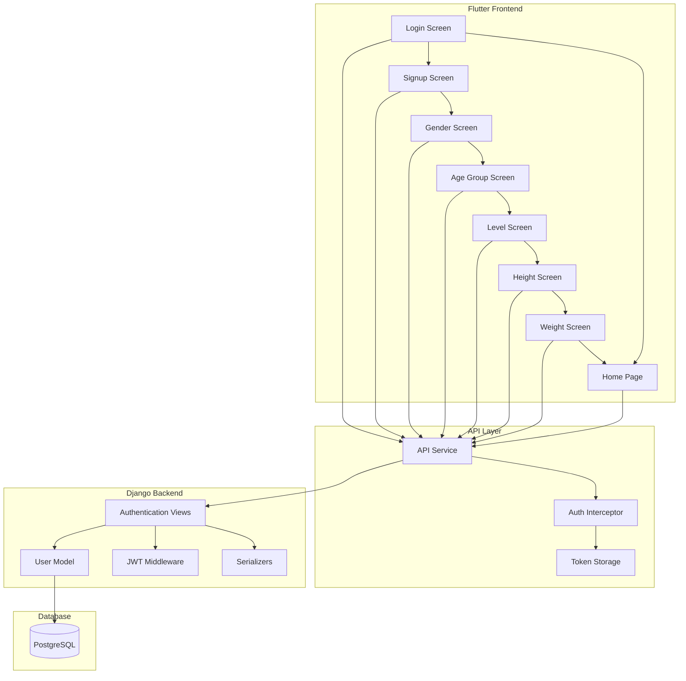

# Design Document: User Authentication and Profile Management

## Overview

This design document outlines the implementation of a complete user authentication and profile management system for the NutriLift fitness app. The system integrates a Django REST API backend with PostgreSQL database and the existing Flutter frontend to provide seamless user registration, login, onboarding, and profile management.

The design leverages the existing Flutter UI screens and implements a robust backend API that handles user data securely with JWT authentication.

## Architecture

### High-Level Architecture



### Technology Stack

**Backend:**
- Django 5.2.8 with Django REST Framework
- PostgreSQL database
- JWT authentication using PyJWT
- Python password hashing with Django's built-in utilities

**Frontend:**
- Flutter with existing UI screens
- HTTP client for API communication
- Secure token storage using shared_preferences
- Form validation and state management

## Components and Interfaces

### Backend Components

#### 1. User Model Extension

Extend Django's built-in User model with a custom profile model:

```python
# models.py
from django.contrib.auth.models import AbstractUser
from django.db import models
import uuid

class User(AbstractUser):
    id = models.UUIDField(primary_key=True, default=uuid.uuid4, editable=False)
    email = models.EmailField(unique=True)
    name = models.CharField(max_length=100, blank=True)
    gender = models.CharField(max_length=10, choices=[('Male', 'Male'), ('Female', 'Female')], blank=True)
    age_group = models.CharField(max_length=20, choices=[
        ('Adult', 'Adult'),
        ('Mid-Age Adult', 'Mid-Age Adult'),
        ('Older Adult', 'Older Adult')
    ], blank=True)
    height = models.FloatField(null=True, blank=True)  # in cm
    weight = models.FloatField(null=True, blank=True)  # in kg
    fitness_level = models.CharField(max_length=20, choices=[
        ('Beginner', 'Beginner'),
        ('Intermediate', 'Intermediate'),
        ('Advance', 'Advance')
    ], blank=True)
    created_at = models.DateTimeField(auto_now_add=True)
    updated_at = models.DateTimeField(auto_now=True)
    
    USERNAME_FIELD = 'email'
    REQUIRED_FIELDS = []
```

#### 2. Authentication Views

```python
# views.py
from rest_framework.decorators import api_view, permission_classes
from rest_framework.permissions import IsAuthenticated
from rest_framework.response import Response
from rest_framework import status
from django.contrib.auth import authenticate
from django.contrib.auth.hashers import make_password
import jwt
from datetime import datetime, timedelta

@api_view(['POST'])
def register(request):
    # Registration logic with validation
    pass

@api_view(['POST'])
def login(request):
    # Login logic with JWT token generation
    pass

@api_view(['GET'])
@permission_classes([IsAuthenticated])
def get_profile(request):
    # Return current user profile
    pass

@api_view(['PUT'])
@permission_classes([IsAuthenticated])
def update_profile(request):
    # Update user profile data
    pass
```

#### 3. Serializers

```python
# serializers.py
from rest_framework import serializers
from .models import User

class UserRegistrationSerializer(serializers.ModelSerializer):
    password = serializers.CharField(write_only=True, min_length=8)
    
    class Meta:
        model = User
        fields = ['email', 'password', 'name']

class UserProfileSerializer(serializers.ModelSerializer):
    class Meta:
        model = User
        fields = ['id', 'email', 'name', 'gender', 'age_group', 'height', 'weight', 'fitness_level', 'created_at']
        read_only_fields = ['id', 'email', 'created_at']

class ProfileUpdateSerializer(serializers.ModelSerializer):
    class Meta:
        model = User
        fields = ['gender', 'age_group', 'height', 'weight', 'fitness_level', 'name']
```

### Frontend Components

#### 1. API Service Layer

```dart
// services/auth_service.dart
class AuthService {
  static const String baseUrl = 'http://localhost:8000/api/auth';
  
  Future<AuthResponse> register(RegisterRequest request) async {
    // POST /api/auth/register
  }
  
  Future<AuthResponse> login(LoginRequest request) async {
    // POST /api/auth/login
  }
  
  Future<UserProfile> getProfile() async {
    // GET /api/auth/me
  }
  
  Future<UserProfile> updateProfile(ProfileUpdateRequest request) async {
    // PUT /api/auth/profile
  }
}
```

#### 2. Token Management

```dart
// services/token_service.dart
class TokenService {
  static const String _tokenKey = 'auth_token';
  
  Future<void> saveToken(String token) async {
    // Save to shared_preferences
  }
  
  Future<String?> getToken() async {
    // Retrieve from shared_preferences
  }
  
  Future<void> clearToken() async {
    // Remove token on logout
  }
}
```

#### 3. Updated Screen Controllers

Modify existing screens to integrate with API:

```dart
// Updated login_screen.dart
class _LoginScreenState extends State<LoginScreen> {
  final _emailController = TextEditingController();
  final _passwordController = TextEditingController();
  final _authService = AuthService();
  
  Future<void> _handleLogin() async {
    try {
      final response = await _authService.login(LoginRequest(
        email: _emailController.text,
        password: _passwordController.text,
      ));
      
      await TokenService().saveToken(response.token);
      Navigator.pushReplacement(context, MaterialPageRoute(builder: (context) => const MainNavigation()));
    } catch (e) {
      // Handle error
    }
  }
}
```

## Data Models

### Request/Response Models

#### Registration Request
```json
{
  "email": "user@example.com",
  "password": "securepassword123",
  "name": "John Doe"
}
```

#### Registration Response
```json
{
  "success": true,
  "message": "User registered successfully",
  "data": {
    "user": {
      "id": "uuid-string",
      "email": "user@example.com",
      "name": "John Doe",
      "gender": "",
      "age_group": "",
      "height": null,
      "weight": null,
      "fitness_level": "",
      "created_at": "2025-01-01T12:00:00Z"
    },
    "token": "jwt-token-string"
  }
}
```

#### Login Request
```json
{
  "email": "user@example.com",
  "password": "securepassword123"
}
```

#### Login Response
```json
{
  "success": true,
  "message": "Login successful",
  "data": {
    "user": {
      "id": "uuid-string",
      "email": "user@example.com",
      "name": "John Doe",
      "gender": "Male",
      "age_group": "Adult",
      "height": 175.0,
      "weight": 70.0,
      "fitness_level": "Intermediate",
      "created_at": "2025-01-01T12:00:00Z"
    },
    "token": "jwt-token-string"
  }
}
```

#### Profile Update Request
```json
{
  "gender": "Male",
  "age_group": "Adult",
  "height": 175.0,
  "weight": 70.0,
  "fitness_level": "Intermediate",
  "name": "John Doe"
}
```

#### Profile Response
```json
{
  "success": true,
  "message": "Profile retrieved successfully",
  "data": {
    "user": {
      "id": "uuid-string",
      "email": "user@example.com",
      "name": "John Doe",
      "gender": "Male",
      "age_group": "Adult",
      "height": 175.0,
      "weight": 70.0,
      "fitness_level": "Intermediate",
      "created_at": "2025-01-01T12:00:00Z"
    }
  }
}
```

### Database Schema

```sql
-- Users table (extends Django's auth_user)
CREATE TABLE users (
    id UUID PRIMARY KEY DEFAULT gen_random_uuid(),
    email VARCHAR(254) UNIQUE NOT NULL,
    password VARCHAR(128) NOT NULL,
    name VARCHAR(100),
    gender VARCHAR(10) CHECK (gender IN ('Male', 'Female')),
    age_group VARCHAR(20) CHECK (age_group IN ('Adult', 'Mid-Age Adult', 'Older Adult')),
    height DECIMAL(5,2),
    weight DECIMAL(5,2),
    fitness_level VARCHAR(20) CHECK (fitness_level IN ('Beginner', 'Intermediate', 'Advance')),
    is_active BOOLEAN DEFAULT TRUE,
    is_staff BOOLEAN DEFAULT FALSE,
    is_superuser BOOLEAN DEFAULT FALSE,
    date_joined TIMESTAMP WITH TIME ZONE DEFAULT NOW(),
    created_at TIMESTAMP WITH TIME ZONE DEFAULT NOW(),
    updated_at TIMESTAMP WITH TIME ZONE DEFAULT NOW()
);

-- Indexes for performance
CREATE INDEX idx_users_email ON users(email);
CREATE INDEX idx_users_created_at ON users(created_at);
```

## Correctness Properties

*A property is a characteristic or behavior that should hold true across all valid executions of a system-essentially, a formal statement about what the system should do. Properties serve as the bridge between human-readable specifications and machine-verifiable correctness guarantees.*

### Property 1: User Registration Success
*For any* valid email and password combination, registration should create a new user account and return an auth token with user data.
**Validates: Requirements 1.1, 1.5**

### Property 2: Email Validation
*For any* invalid email format, the registration system should reject the request with a validation error.
**Validates: Requirements 1.2**

### Property 3: Password Length Validation
*For any* password shorter than the minimum required length, the system should reject registration with a validation error.
**Validates: Requirements 1.3**

### Property 4: Password Security
*For any* user registration or password update, the stored password should be hashed and never stored in plain text.
**Validates: Requirements 1.6, 6.3, 8.1**

### Property 5: Login Authentication
*For any* valid user credentials, login should return an auth token and user profile data.
**Validates: Requirements 2.1, 2.4**

### Property 6: Authentication Failure
*For any* incorrect credentials, login should return an authentication error without exposing sensitive information.
**Validates: Requirements 2.2, 8.3**

### Property 7: Input Validation
*For any* malformed input data, the system should return appropriate validation errors before processing.
**Validates: Requirements 2.3, 8.2**

### Property 8: Profile Update Persistence
*For any* authenticated user profile update, the changes should be stored in the database and retrievable via profile endpoint.
**Validates: Requirements 3.1, 3.2**

### Property 9: Numeric Field Validation
*For any* profile update with age, height, or weight values, only positive numbers should be accepted.
**Validates: Requirements 3.3, 3.4**

### Property 10: Enum Field Validation
*For any* profile update with gender or fitness_level, only predefined allowed values should be accepted.
**Validates: Requirements 3.5**

### Property 11: Token Generation and Validation
*For any* successful authentication, a secure token should be generated and validate correctly for subsequent requests.
**Validates: Requirements 4.1, 4.2, 8.5**

### Property 12: Token Rejection
*For any* invalid, expired, or malformed token, protected endpoints should return unauthorized errors.
**Validates: Requirements 4.3, 8.4**

### Property 13: Token Storage Round-trip
*For any* auth token, storing and retrieving it from device storage should return the same token value.
**Validates: Requirements 4.4**

### Property 14: Network Error Handling
*For any* network error during API calls, the Flutter client should handle it gracefully with user-friendly messages.
**Validates: Requirements 5.5**

### Property 15: Database Uniqueness
*For any* user record, the database should enforce unique identifiers and email addresses.
**Validates: Requirements 6.1, 6.2**

### Property 16: Timestamp Tracking
*For any* user record creation or update, appropriate timestamps should be set and maintained.
**Validates: Requirements 6.4**

### Property 17: Atomic Operations
*For any* user data update operation, either all changes should be applied or none, maintaining data consistency.
**Validates: Requirements 6.5**

### Property 18: Response Format Consistency
*For any* API endpoint response, the JSON structure should follow the consistent format with success/error indicators.
**Validates: Requirements 7.5**

### Property 19: HTTP Status Codes
*For any* API request, appropriate HTTP status codes should be returned based on the operation result.
**Validates: Requirements 7.6**

## Error Handling

### Backend Error Handling

#### Validation Errors
- **Email Format**: Return 400 Bad Request with specific field error
- **Password Length**: Return 400 Bad Request with password requirements
- **Required Fields**: Return 400 Bad Request listing missing fields
- **Invalid Enum Values**: Return 400 Bad Request with allowed values

#### Authentication Errors
- **Invalid Credentials**: Return 401 Unauthorized with generic message
- **Expired Token**: Return 401 Unauthorized with token expiry message
- **Missing Token**: Return 401 Unauthorized requesting authentication

#### Database Errors
- **Duplicate Email**: Return 409 Conflict with user-friendly message
- **Connection Issues**: Return 500 Internal Server Error with retry suggestion
- **Constraint Violations**: Return 400 Bad Request with specific constraint info

### Frontend Error Handling

#### Network Errors
- **Connection Timeout**: Show retry dialog with offline indicator
- **No Internet**: Display offline mode message with retry option
- **Server Errors**: Show generic error with support contact info

#### Validation Errors
- **Form Validation**: Real-time field validation with inline error messages
- **API Validation**: Display server validation errors next to relevant fields
- **Required Fields**: Highlight missing fields with clear error text

#### Authentication Errors
- **Invalid Login**: Clear password field and show error message
- **Token Expiry**: Redirect to login screen with session expired message
- **Unauthorized Access**: Redirect to login with appropriate message

## Testing Strategy

### Dual Testing Approach

The system will use both unit tests and property-based tests to ensure comprehensive coverage:

**Unit Tests**: Verify specific examples, edge cases, and error conditions
- Test specific email formats (valid and invalid examples)
- Test password requirements with boundary values
- Test API endpoint responses with known data
- Test UI navigation flows with mock data
- Test error handling with simulated failures

**Property-Based Tests**: Verify universal properties across all inputs
- Generate random valid user data and verify registration success
- Generate random invalid inputs and verify proper rejection
- Test authentication with various credential combinations
- Verify profile updates with random valid data
- Test token validation with various token states

### Property-Based Testing Configuration

**Framework**: Use Hypothesis for Python backend tests and test package with property testing for Dart frontend tests

**Test Configuration**:
- Minimum 100 iterations per property test
- Each property test references its design document property
- Tag format: **Feature: user-authentication-profile, Property {number}: {property_text}**

**Backend Property Tests** (using Hypothesis):
```python
@given(email=emails(), password=text(min_size=8))
def test_registration_with_valid_data(email, password):
    """Feature: user-authentication-profile, Property 1: User Registration Success"""
    # Test implementation
```

**Frontend Property Tests** (using Dart test framework):
```dart
testWidgets('Feature: user-authentication-profile, Property 13: Token Storage Round-trip', (tester) async {
  // Property test implementation
});
```

### Integration Testing

**End-to-End Flow Tests**:
- Complete registration → onboarding → profile update → home screen flow
- Login → home screen → profile view flow
- Token expiry → re-authentication flow
- Network failure → retry → success flow

**API Integration Tests**:
- Test all four main endpoints with real database
- Verify JWT token generation and validation
- Test database constraints and transactions
- Verify CORS and security headers

### Performance Testing

**Load Testing**:
- Test registration endpoint with concurrent users
- Test login endpoint under load
- Verify database performance with large user datasets
- Test token validation performance

**Mobile Performance**:
- Test app startup time with stored tokens
- Verify smooth UI transitions during API calls
- Test memory usage during profile updates
- Verify battery impact of background token refresh

## Implementation Notes

### Security Considerations

1. **Password Security**: Use Django's built-in PBKDF2 password hashing
2. **JWT Security**: Use strong secret keys and appropriate expiration times
3. **HTTPS Only**: Enforce HTTPS in production for all API communications
4. **Input Sanitization**: Validate and sanitize all user inputs
5. **Rate Limiting**: Implement rate limiting on authentication endpoints

### Performance Optimizations

1. **Database Indexing**: Index frequently queried fields (email, created_at)
2. **Connection Pooling**: Use database connection pooling for better performance
3. **Caching**: Cache user profile data in Flutter app for offline access
4. **Lazy Loading**: Load profile data only when needed in UI
5. **Compression**: Enable gzip compression for API responses

### Deployment Considerations

1. **Environment Variables**: Use environment variables for sensitive configuration
2. **Database Migrations**: Implement proper Django migrations for schema changes
3. **API Versioning**: Design API with versioning support for future changes
4. **Monitoring**: Implement logging and monitoring for authentication events
5. **Backup Strategy**: Regular database backups with point-in-time recovery