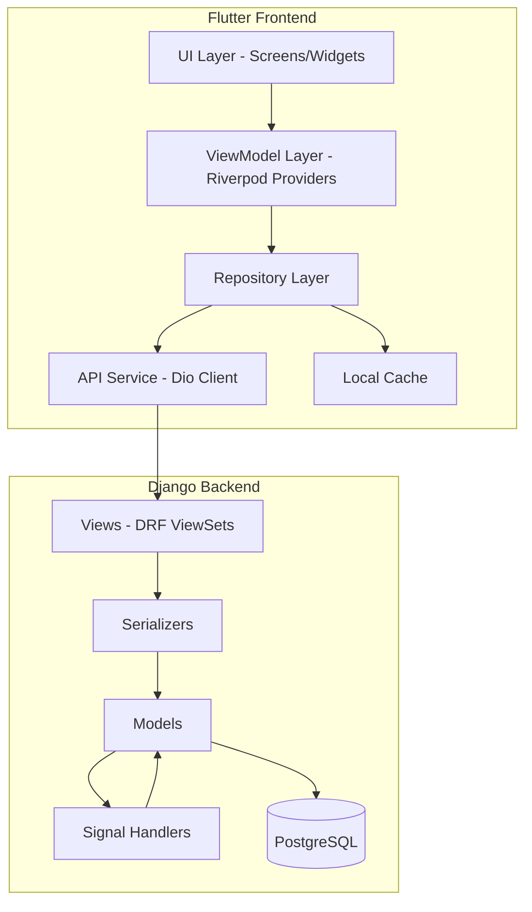
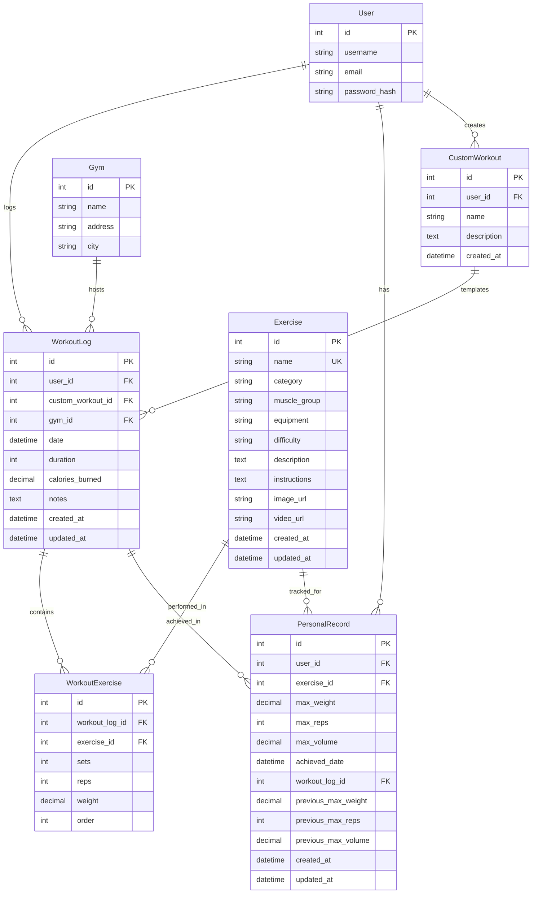

# Design Document: NutriLift Workout Tracking System

## Overview

The NutriLift Workout Tracking System is a full-stack fitness tracking solution built with Django REST Framework (backend) and Flutter (frontend). The system enables users to log workouts, track personal records automatically, browse a comprehensive exercise library, and view detailed workout history with analytics.

The architecture follows clean architecture principles with clear separation between data, domain, and presentation layers. The backend implements RESTful APIs with automatic PR detection via Django signals, while the frontend uses MVVM pattern with Riverpod state management and repository pattern for data access.

### Key Design Principles

1. **Separation of Concerns**: Clear boundaries between UI, business logic, and data layers
2. **Testability**: All components designed for easy unit and integration testing
3. **Scalability**: Pagination, caching, and database optimization for performance
4. **Real-time Updates**: Stream-based state management for responsive UI
5. **Offline Support**: Local caching and mock data for development
6. **Security**: JWT authentication and input validation at all layers
7. **Consistency**: Red theme (#E53935) and existing navigation patterns

## Architecture

### System Architecture Diagram



### Backend Architecture

**Technology Stack:**
- Django 5.2.8
- Django REST Framework 3.14+
- PostgreSQL 14+
- JWT Authentication (djangorestframework-simplejwt)
- Django Signals for automatic PR detection

**Layer Responsibilities:**

1. **Models Layer**: Data models with business logic and validation
2. **Serializers Layer**: Data transformation and validation for API
3. **Views Layer**: Request handling and response formatting
4. **Signals Layer**: Event-driven automatic actions (PR detection)
5. **Management Commands**: Database seeding and maintenance

### Frontend Architecture

**Technology Stack:**
- Flutter 3.8.1
- Riverpod 2.3+ (State Management)
- Dio 5.0+ (HTTP Client)
- Freezed (Immutable Models)
- Flutter Hooks (Widget Lifecycle)

**Layer Responsibilities:**

1. **UI Layer**: Screens and widgets (presentation only)
2. **ViewModel Layer**: State management and business logic
3. **Repository Layer**: Data access abstraction
4. **Service Layer**: API communication and caching
5. **Model Layer**: Data models and domain entities

### MVVM Pattern Implementation

```
Screen (View)
    ↓ reads state
ViewModel (Riverpod Provider)
    ↓ calls methods
Repository (Interface)
    ↓ implements
API Service / Mock Service
```

## Components and Interfaces

### Backend Components

#### 1. Enhanced Exercise Model

**Purpose**: Store comprehensive exercise information with metadata for filtering

**Fields**:
```python
class Exercise(models.Model):
    name = models.CharField(max_length=200, unique=True)
    category = models.CharField(max_length=50, choices=CATEGORY_CHOICES)
    muscle_group = models.CharField(max_length=50, choices=MUSCLE_GROUP_CHOICES)
    equipment = models.CharField(max_length=50, choices=EQUIPMENT_CHOICES)
    difficulty = models.CharField(max_length=20, choices=DIFFICULTY_CHOICES)
    description = models.TextField()
    instructions = models.TextField()
    image_url = models.URLField(blank=True, null=True)
    video_url = models.URLField(blank=True, null=True)
    created_at = models.DateTimeField(auto_now_add=True)
    updated_at = models.DateTimeField(auto_now=True)
```

**Choices**:
- CATEGORY_CHOICES: Strength, Cardio, Bodyweight
- MUSCLE_GROUP_CHOICES: Chest, Back, Legs, Core, Arms, Shoulders, Full Body
- EQUIPMENT_CHOICES: Free Weights, Machines, Bodyweight, Resistance Bands, Cardio Equipment
- DIFFICULTY_CHOICES: Beginner, Intermediate, Advanced

#### 2. Enhanced WorkoutLog Model

**Purpose**: Store complete workout sessions with calculated metrics

**Fields**:
```python
class WorkoutLog(models.Model):
    user = models.ForeignKey(User, on_delete=models.CASCADE)
    custom_workout = models.ForeignKey(CustomWorkout, on_delete=models.SET_NULL, null=True, blank=True)
    gym = models.ForeignKey(Gym, on_delete=models.SET_NULL, null=True, blank=True)
    date = models.DateTimeField(default=timezone.now)
    duration = models.IntegerField(help_text="Duration in minutes")
    calories_burned = models.DecimalField(max_digits=6, decimal_places=2)
    notes = models.TextField(blank=True)
    created_at = models.DateTimeField(auto_now_add=True)
    updated_at = models.DateTimeField(auto_now=True)
```

**Methods**:
- `calculate_calories()`: Calculate calories based on exercises and duration
- `check_personal_records()`: Trigger PR detection after save

#### 3. WorkoutExercise Model

**Purpose**: Store individual exercises within a workout with sets/reps/weight

**Fields**:
```python
class WorkoutExercise(models.Model):
    workout_log = models.ForeignKey(WorkoutLog, on_delete=models.CASCADE, related_name='exercises')
    exercise = models.ForeignKey(Exercise, on_delete=models.CASCADE)
    sets = models.IntegerField(validators=[MinValueValidator(1), MaxValueValidator(100)])
    reps = models.IntegerField(validators=[MinValueValidator(1), MaxValueValidator(100)])
    weight = models.DecimalField(max_digits=6, decimal_places=2, validators=[MinValueValidator(0.1), MaxValueValidator(1000)])
    order = models.IntegerField(default=0)
```

**Methods**:
- `calculate_volume()`: Return sets * reps * weight

#### 4. Enhanced PersonalRecord Model

**Purpose**: Track maximum achievements for each exercise

**Fields**:
```python
class PersonalRecord(models.Model):
    user = models.ForeignKey(User, on_delete=models.CASCADE)
    exercise = models.ForeignKey(Exercise, on_delete=models.CASCADE)
    max_weight = models.DecimalField(max_digits=6, decimal_places=2)
    max_reps = models.IntegerField()
    max_volume = models.DecimalField(max_digits=10, decimal_places=2)
    achieved_date = models.DateTimeField()
    workout_log = models.ForeignKey(WorkoutLog, on_delete=models.SET_NULL, null=True)
    previous_max_weight = models.DecimalField(max_digits=6, decimal_places=2, null=True)
    previous_max_reps = models.IntegerField(null=True)
    previous_max_volume = models.DecimalField(max_digits=10, decimal_places=2, null=True)
    created_at = models.DateTimeField(auto_now_add=True)
    updated_at = models.DateTimeField(auto_now=True)
    
    class Meta:
        unique_together = ['user', 'exercise']
```

**Methods**:
- `get_improvement_percentage()`: Calculate percentage improvement over previous PR

#### 5. Signal Handlers

**Purpose**: Automatically detect and update personal records when workouts are logged

**Implementation**:
```python
@receiver(post_save, sender=WorkoutLog)
def check_personal_records(sender, instance, created, **kwargs):
    if created:
        for workout_exercise in instance.exercises.all():
            update_personal_record(instance.user, workout_exercise)

def update_personal_record(user, workout_exercise):
    exercise = workout_exercise.exercise
    volume = workout_exercise.calculate_volume()
    
    pr, created = PersonalRecord.objects.get_or_create(
        user=user,
        exercise=exercise,
        defaults={
            'max_weight': workout_exercise.weight,
            'max_reps': workout_exercise.reps,
            'max_volume': volume,
            'achieved_date': timezone.now(),
            'workout_log': workout_exercise.workout_log
        }
    )
    
    if not created:
        updated = False
        if workout_exercise.weight > pr.max_weight:
            pr.previous_max_weight = pr.max_weight
            pr.max_weight = workout_exercise.weight
            updated = True
        if workout_exercise.reps > pr.max_reps:
            pr.previous_max_reps = pr.max_reps
            pr.max_reps = workout_exercise.reps
            updated = True
        if volume > pr.max_volume:
            pr.previous_max_volume = pr.max_volume
            pr.max_volume = volume
            updated = True
        
        if updated:
            pr.achieved_date = timezone.now()
            pr.workout_log = workout_exercise.workout_log
            pr.save()
```

#### 6. API ViewSets

**WorkoutViewSet**:
- `log_workout()`: POST endpoint for logging workouts
- `get_history()`: GET endpoint with filtering and pagination
- `get_statistics()`: GET endpoint for analytics

**ExerciseViewSet**:
- `list()`: GET endpoint with filtering by category, muscle, equipment, difficulty
- `retrieve()`: GET endpoint for single exercise details

**PersonalRecordViewSet**:
- `list()`: GET endpoint for user's PRs

#### 7. Serializers

**ExerciseSerializer**:
```python
class ExerciseSerializer(serializers.ModelSerializer):
    class Meta:
        model = Exercise
        fields = '__all__'
```

**WorkoutExerciseSerializer**:
```python
class WorkoutExerciseSerializer(serializers.ModelSerializer):
    exercise_name = serializers.CharField(source='exercise.name', read_only=True)
    volume = serializers.SerializerMethodField()
    
    class Meta:
        model = WorkoutExercise
        fields = ['id', 'exercise', 'exercise_name', 'sets', 'reps', 'weight', 'volume', 'order']
    
    def get_volume(self, obj):
        return obj.calculate_volume()
```

**WorkoutLogSerializer**:
```python
class WorkoutLogSerializer(serializers.ModelSerializer):
    exercises = WorkoutExerciseSerializer(many=True)
    gym_name = serializers.CharField(source='gym.name', read_only=True)
    workout_name = serializers.CharField(source='custom_workout.name', read_only=True)
    has_new_prs = serializers.SerializerMethodField()
    
    class Meta:
        model = WorkoutLog
        fields = ['id', 'user', 'custom_workout', 'workout_name', 'gym', 'gym_name', 
                  'date', 'duration', 'calories_burned', 'notes', 'exercises', 'has_new_prs']
        read_only_fields = ['user', 'calories_burned']
    
    def create(self, validated_data):
        exercises_data = validated_data.pop('exercises')
        workout_log = WorkoutLog.objects.create(**validated_data)
        
        for exercise_data in exercises_data:
            WorkoutExercise.objects.create(workout_log=workout_log, **exercise_data)
        
        workout_log.calories_burned = workout_log.calculate_calories()
        workout_log.save()
        
        return workout_log
    
    def get_has_new_prs(self, obj):
        # Check if any exercises in this workout resulted in new PRs
        return PersonalRecord.objects.filter(
            user=obj.user,
            workout_log=obj,
            achieved_date=obj.date
        ).exists()
```

**PersonalRecordSerializer**:
```python
class PersonalRecordSerializer(serializers.ModelSerializer):
    exercise_name = serializers.CharField(source='exercise.name', read_only=True)
    improvement_percentage = serializers.SerializerMethodField()
    
    class Meta:
        model = PersonalRecord
        fields = ['id', 'exercise', 'exercise_name', 'max_weight', 'max_reps', 
                  'max_volume', 'achieved_date', 'improvement_percentage']
    
    def get_improvement_percentage(self, obj):
        return obj.get_improvement_percentage()
```

### Frontend Components

#### 1. Data Models (Freezed)

**Exercise Model**:
```dart
@freezed
class Exercise with _$Exercise {
  const factory Exercise({
    required int id,
    required String name,
    required String category,
    required String muscleGroup,
    required String equipment,
    required String difficulty,
    required String description,
    required String instructions,
    String? imageUrl,
    String? videoUrl,
  }) = _Exercise;
  
  factory Exercise.fromJson(Map<String, dynamic> json) => _$ExerciseFromJson(json);
}
```

**WorkoutExercise Model**:
```dart
@freezed
class WorkoutExercise with _$WorkoutExercise {
  const factory WorkoutExercise({
    int? id,
    required int exerciseId,
    required String exerciseName,
    required int sets,
    required int reps,
    required double weight,
    required double volume,
    required int order,
  }) = _WorkoutExercise;
  
  factory WorkoutExercise.fromJson(Map<String, dynamic> json) => _$WorkoutExerciseFromJson(json);
}
```

**WorkoutLog Model**:
```dart
@freezed
class WorkoutLog with _$WorkoutLog {
  const factory WorkoutLog({
    int? id,
    int? customWorkoutId,
    String? workoutName,
    int? gymId,
    String? gymName,
    required DateTime date,
    required int duration,
    required double caloriesBurned,
    String? notes,
    required List<WorkoutExercise> exercises,
    required bool hasNewPrs,
  }) = _WorkoutLog;
  
  factory WorkoutLog.fromJson(Map<String, dynamic> json) => _$WorkoutLogFromJson(json);
}
```

**PersonalRecord Model**:
```dart
@freezed
class PersonalRecord with _$PersonalRecord {
  const factory PersonalRecord({
    required int id,
    required int exerciseId,
    required String exerciseName,
    required double maxWeight,
    required int maxReps,
    required double maxVolume,
    required DateTime achievedDate,
    double? improvementPercentage,
  }) = _PersonalRecord;
  
  factory PersonalRecord.fromJson(Map<String, dynamic> json) => _$PersonalRecordFromJson(json);
}
```

#### 2. Repository Interface

**WorkoutRepository**:
```dart
abstract class WorkoutRepository {
  Future<List<WorkoutLog>> getWorkoutHistory({DateTime? dateFrom, int? limit});
  Future<WorkoutLog> logWorkout(WorkoutLog workout);
  Future<Map<String, dynamic>> getStatistics({DateTime? dateFrom, DateTime? dateTo});
}
```

**ExerciseRepository**:
```dart
abstract class ExerciseRepository {
  Future<List<Exercise>> getExercises({
    String? category,
    String? muscleGroup,
    String? equipment,
    String? difficulty,
    String? search,
  });
  Future<Exercise> getExerciseById(int id);
}
```

**PersonalRecordRepository**:
```dart
abstract class PersonalRecordRepository {
  Future<List<PersonalRecord>> getPersonalRecords();
  Future<PersonalRecord?> getPersonalRecordForExercise(int exerciseId);
}
```

#### 3. API Service Implementation

**WorkoutApiService**:
```dart
class WorkoutApiService implements WorkoutRepository {
  final Dio _dio;
  final String _baseUrl;
  
  WorkoutApiService(this._dio, this._baseUrl);
  
  @override
  Future<List<WorkoutLog>> getWorkoutHistory({DateTime? dateFrom, int? limit}) async {
    final queryParams = <String, dynamic>{};
    if (dateFrom != null) {
      queryParams['date_from'] = dateFrom.toIso8601String();
    }
    if (limit != null) {
      queryParams['limit'] = limit;
    }
    
    final response = await _dio.get(
      '$_baseUrl/api/workouts/history/',
      queryParameters: queryParams,
    );
    
    return (response.data as List)
        .map((json) => WorkoutLog.fromJson(json))
        .toList();
  }
  
  @override
  Future<WorkoutLog> logWorkout(WorkoutLog workout) async {
    final response = await _dio.post(
      '$_baseUrl/api/workouts/log/',
      data: workout.toJson(),
    );
    
    return WorkoutLog.fromJson(response.data);
  }
  
  @override
  Future<Map<String, dynamic>> getStatistics({DateTime? dateFrom, DateTime? dateTo}) async {
    final queryParams = <String, dynamic>{};
    if (dateFrom != null) {
      queryParams['date_from'] = dateFrom.toIso8601String();
    }
    if (dateTo != null) {
      queryParams['date_to'] = dateTo.toIso8601String();
    }
    
    final response = await _dio.get(
      '$_baseUrl/api/workouts/statistics/',
      queryParameters: queryParams,
    );
    
    return response.data;
  }
}
```

**ExerciseApiService**:
```dart
class ExerciseApiService implements ExerciseRepository {
  final Dio _dio;
  final String _baseUrl;
  
  ExerciseApiService(this._dio, this._baseUrl);
  
  @override
  Future<List<Exercise>> getExercises({
    String? category,
    String? muscleGroup,
    String? equipment,
    String? difficulty,
    String? search,
  }) async {
    final queryParams = <String, dynamic>{};
    if (category != null) queryParams['category'] = category;
    if (muscleGroup != null) queryParams['muscle'] = muscleGroup;
    if (equipment != null) queryParams['equipment'] = equipment;
    if (difficulty != null) queryParams['difficulty'] = difficulty;
    if (search != null) queryParams['search'] = search;
    
    final response = await _dio.get(
      '$_baseUrl/api/exercises/',
      queryParameters: queryParams,
    );
    
    return (response.data as List)
        .map((json) => Exercise.fromJson(json))
        .toList();
  }
  
  @override
  Future<Exercise> getExerciseById(int id) async {
    final response = await _dio.get('$_baseUrl/api/exercises/$id/');
    return Exercise.fromJson(response.data);
  }
}
```

#### 4. Riverpod Providers

**Workout History Provider**:
```dart
final workoutHistoryProvider = StateNotifierProvider<WorkoutHistoryNotifier, AsyncValue<List<WorkoutLog>>>((ref) {
  final repository = ref.watch(workoutRepositoryProvider);
  return WorkoutHistoryNotifier(repository);
});

class WorkoutHistoryNotifier extends StateNotifier<AsyncValue<List<WorkoutLog>>> {
  final WorkoutRepository _repository;
  
  WorkoutHistoryNotifier(this._repository) : super(const AsyncValue.loading()) {
    loadWorkouts();
  }
  
  Future<void> loadWorkouts({DateTime? dateFrom, int? limit}) async {
    state = const AsyncValue.loading();
    state = await AsyncValue.guard(() => _repository.getWorkoutHistory(
      dateFrom: dateFrom,
      limit: limit,
    ));
  }
  
  Future<void> refresh() async {
    await loadWorkouts();
  }
}
```

**Exercise Library Provider**:
```dart
final exerciseLibraryProvider = StateNotifierProvider<ExerciseLibraryNotifier, AsyncValue<List<Exercise>>>((ref) {
  final repository = ref.watch(exerciseRepositoryProvider);
  return ExerciseLibraryNotifier(repository);
});

class ExerciseLibraryNotifier extends StateNotifier<AsyncValue<List<Exercise>>> {
  final ExerciseRepository _repository;
  
  ExerciseLibraryNotifier(this._repository) : super(const AsyncValue.loading()) {
    loadExercises();
  }
  
  Future<void> loadExercises({
    String? category,
    String? muscleGroup,
    String? equipment,
    String? difficulty,
    String? search,
  }) async {
    state = const AsyncValue.loading();
    state = await AsyncValue.guard(() => _repository.getExercises(
      category: category,
      muscleGroup: muscleGroup,
      equipment: equipment,
      difficulty: difficulty,
      search: search,
    ));
  }
}
```

**Personal Records Provider**:
```dart
final personalRecordsProvider = StateNotifierProvider<PersonalRecordsNotifier, AsyncValue<List<PersonalRecord>>>((ref) {
  final repository = ref.watch(personalRecordRepositoryProvider);
  return PersonalRecordsNotifier(repository);
});

class PersonalRecordsNotifier extends StateNotifier<AsyncValue<List<PersonalRecord>>> {
  final PersonalRecordRepository _repository;
  
  PersonalRecordsNotifier(this._repository) : super(const AsyncValue.loading()) {
    loadPersonalRecords();
  }
  
  Future<void> loadPersonalRecords() async {
    state = const AsyncValue.loading();
    state = await AsyncValue.guard(() => _repository.getPersonalRecords());
  }
}
```

#### 5. UI Screens

**WorkoutHistoryScreen**:
- AppBar with NutriLiftHeader
- RefreshIndicator for pull-to-refresh
- ListView of WorkoutCard widgets
- FloatingActionButton to navigate to NewWorkoutScreen
- Date range filter dialog
- Empty state when no workouts

**NewWorkoutScreen**:
- Form with workout template dropdown
- Exercise list with add/remove buttons
- Input fields for sets, reps, weight per exercise
- Duration input with validation
- Optional gym selection
- Save button with loading state
- Validation error display

**ExerciseLibraryScreen**:
- Search bar
- Filter chips for category, muscle group, equipment, difficulty
- GridView of ExerciseCard widgets
- Exercise detail bottom sheet
- Add to workout button

**PersonalRecordsScreen**:
- GridView of PRCard widgets
- Each card shows exercise name, max weight, max reps, max volume
- Progress indicators for improvements
- Share button per PR
- Tap to navigate to filtered workout history

#### 6. Widgets

**WorkoutCard**:
```dart
class WorkoutCard extends StatelessWidget {
  final WorkoutLog workout;
  
  @override
  Widget build(BuildContext context) {
    return Card(
      child: ListTile(
        title: Text(workout.workoutName ?? 'Workout'),
        subtitle: Column(
          crossAxisAlignment: CrossAxisAlignment.start,
          children: [
            Text('${workout.date.format()} • ${workout.duration} min'),
            Text('${workout.caloriesBurned} cal burned'),
            if (workout.gymName != null) Text('at ${workout.gymName}'),
          ],
        ),
        trailing: workout.hasNewPrs ? Icon(Icons.emoji_events, color: Colors.amber) : null,
      ),
    );
  }
}
```

**ExerciseCard**:
```dart
class ExerciseCard extends StatelessWidget {
  final Exercise exercise;
  final VoidCallback? onTap;
  
  @override
  Widget build(BuildContext context) {
    return Card(
      child: InkWell(
        onTap: onTap,
        child: Column(
          children: [
            if (exercise.imageUrl != null)
              CachedNetworkImage(imageUrl: exercise.imageUrl!),
            Text(exercise.name),
            Text(exercise.muscleGroup),
            Chip(label: Text(exercise.difficulty)),
          ],
        ),
      ),
    );
  }
}
```

**PRCard**:
```dart
class PRCard extends StatelessWidget {
  final PersonalRecord pr;
  
  @override
  Widget build(BuildContext context) {
    return Card(
      child: Padding(
        padding: EdgeInsets.all(16),
        child: Column(
          children: [
            Text(pr.exerciseName, style: Theme.of(context).textTheme.headline6),
            Text('${pr.maxWeight} kg'),
            Text('${pr.maxReps} reps'),
            Text('${pr.maxVolume} volume'),
            Text('${pr.achievedDate.format()}'),
            if (pr.improvementPercentage != null)
              LinearProgressIndicator(value: pr.improvementPercentage! / 100),
          ],
        ),
      ),
    );
  }
}
```

## Data Models

### Database Schema



### API Request/Response Models

**POST /api/workouts/log/ Request**:
```json
{
  "custom_workout": 1,
  "gym": 2,
  "date": "2024-01-15T10:30:00Z",
  "duration": 60,
  "notes": "Great workout!",
  "exercises": [
    {
      "exercise": 1,
      "sets": 3,
      "reps": 10,
      "weight": 100.0,
      "order": 0
    },
    {
      "exercise": 2,
      "sets": 4,
      "reps": 8,
      "weight": 80.0,
      "order": 1
    }
  ]
}
```

**POST /api/workouts/log/ Response**:
```json
{
  "id": 123,
  "user": 1,
  "custom_workout": 1,
  "workout_name": "Push Day",
  "gym": 2,
  "gym_name": "Gold's Gym",
  "date": "2024-01-15T10:30:00Z",
  "duration": 60,
  "calories_burned": 450.50,
  "notes": "Great workout!",
  "exercises": [
    {
      "id": 456,
      "exercise": 1,
      "exercise_name": "Bench Press",
      "sets": 3,
      "reps": 10,
      "weight": 100.0,
      "volume": 3000.0,
      "order": 0
    },
    {
      "id": 457,
      "exercise": 2,
      "exercise_name": "Shoulder Press",
      "sets": 4,
      "reps": 8,
      "weight": 80.0,
      "volume": 2560.0,
      "order": 1
    }
  ],
  "has_new_prs": true
}
```

**GET /api/workouts/history/ Response**:
```json
[
  {
    "id": 123,
    "user": 1,
    "custom_workout": 1,
    "workout_name": "Push Day",
    "gym": 2,
    "gym_name": "Gold's Gym",
    "date": "2024-01-15T10:30:00Z",
    "duration": 60,
    "calories_burned": 450.50,
    "notes": "Great workout!",
    "exercises": [...],
    "has_new_prs": true
  }
]
```

**GET /api/exercises/ Response**:
```json
[
  {
    "id": 1,
    "name": "Bench Press",
    "category": "Strength",
    "muscle_group": "Chest",
    "equipment": "Free Weights",
    "difficulty": "Intermediate",
    "description": "A compound upper body exercise",
    "instructions": "Lie on bench, lower bar to chest, press up",
    "image_url": "https://example.com/bench-press.jpg",
    "video_url": "https://youtube.com/watch?v=..."
  }
]
```

**GET /api/personal-records/ Response**:
```json
[
  {
    "id": 1,
    "exercise": 1,
    "exercise_name": "Bench Press",
    "max_weight": 120.0,
    "max_reps": 12,
    "max_volume": 4320.0,
    "achieved_date": "2024-01-15T10:30:00Z",
    "improvement_percentage": 15.5
  }
]
```

**GET /api/workouts/statistics/ Response**:
```json
{
  "total_workouts": 45,
  "total_calories": 20250.0,
  "total_duration": 2700,
  "average_duration": 60,
  "average_calories": 450.0,
  "workouts_by_category": {
    "Strength": 30,
    "Cardio": 10,
    "Bodyweight": 5
  },
  "most_frequent_exercises": [
    {"name": "Bench Press", "count": 25},
    {"name": "Squats", "count": 22}
  ],
  "workout_frequency": {
    "2024-01": 12,
    "2024-02": 15,
    "2024-03": 18
  }
}
```


## Correctness Properties

*A property is a characteristic or behavior that should hold true across all valid executions of a system—essentially, a formal statement about what the system should do. Properties serve as the bridge between human-readable specifications and machine-verifiable correctness guarantees.*

### Property 1: Workout History Ordering

*For any* list of workouts, when displayed in the workout history screen, they should be ordered by date in descending order (newest first).

**Validates: Requirements 1.1, 1.7**

### Property 2: Date Range Filtering

*For any* date range filter applied to workout history, all returned workouts should have dates within the specified range (inclusive).

**Validates: Requirements 1.2**

### Property 3: Workout Card Completeness

*For any* workout, the rendered workout card should contain all required fields: workout name (or "Workout"), date, duration, calories burned, and gym name if available. Additionally, if the workout has new PRs (has_new_prs=true), a PR badge should be displayed.

**Validates: Requirements 1.3, 1.4**

### Property 4: Template Pre-population

*For any* workout template, when selected, the exercise list should be pre-populated with all exercises from that template in the correct order.

**Validates: Requirements 2.2**

### Property 5: Exercise Search Filtering

*For any* search term, all returned exercises should have names that contain the search term (case-insensitive).

**Validates: Requirements 2.3, 3.6**

### Property 6: Exercise Addition to Workout

*For any* workout being created, adding an exercise should increase the workout's exercise list length by exactly one.

**Validates: Requirements 2.4, 3.8**

### Property 7: Input Validation Ranges

*For any* workout submission, the system should reject inputs where duration is outside 1-600 minutes, reps are outside 1-100, or weight is outside 0.1-1000 kg, and should accept inputs within these ranges.

**Validates: Requirements 2.5, 2.6, 2.7, 9.1, 9.2, 9.3, 9.9**

### Property 8: Workout Persistence and Response

*For any* valid workout submission, the backend should persist the workout to the database and return a 201 Created status with the complete workout object including calculated calories and PR flags.

**Validates: Requirements 2.9, 14.1, 14.2**

### Property 9: Calories Calculation

*For any* workout log, the calculated calories burned should be a positive number based on the exercises, duration, and intensity factors.

**Validates: Requirements 2.10**

### Property 10: Personal Record Detection and Update

*For any* workout logged, if any exercise performance (weight, reps, or volume) exceeds the user's existing personal record for that exercise, the system should automatically update the PersonalRecord entry with the new values and store the previous values for comparison.

**Validates: Requirements 2.11, 4.7, 5.6, 5.7, 5.8**

### Property 11: Exercise Filter Combination

*For any* combination of filters (category, muscle group, equipment, difficulty), all returned exercises should match ALL applied filters simultaneously.

**Validates: Requirements 3.2, 3.3, 3.4, 3.5, 3.9**

### Property 12: Personal Record Display Completeness

*For any* personal record, the displayed information should include exercise name, max weight, max reps, max volume, and date achieved. If improvement data exists (previous values), a progress indicator should be shown.

**Validates: Requirements 4.2, 4.3**

### Property 13: PR Share Message Generation

*For any* personal record, the system should generate a valid shareable message containing the exercise name, achievement values, and date.

**Validates: Requirements 4.5**

### Property 14: User-Scoped Personal Records

*For any* authenticated user requesting personal records, the system should return only PRs belonging to that user and no PRs from other users.

**Validates: Requirements 4.6**

### Property 15: PR Notification Creation

*For any* workout that results in a new personal record, the system should create a notification for the user and include PR achievement data in the workout log response.

**Validates: Requirements 4.8, 8.2, 8.6**

### Property 16: Exercise Category Validation

*For any* exercise, the category field should only accept values from the set: {Strength, Cardio, Bodyweight}, and should reject any other values.

**Validates: Requirements 6.2**

### Property 17: Exercise Muscle Group Validation

*For any* exercise, the muscle_group field should only accept values from the set: {Chest, Back, Legs, Core, Arms, Shoulders, Full Body}, and should reject any other values.

**Validates: Requirements 6.3**

### Property 18: Exercise Equipment Validation

*For any* exercise, the equipment field should only accept values from the set: {Free Weights, Machines, Bodyweight, Resistance Bands, Cardio Equipment}, and should reject any other values.

**Validates: Requirements 6.4**

### Property 19: Exercise Difficulty Validation

*For any* exercise, the difficulty field should only accept values from the set: {Beginner, Intermediate, Advanced}, and should reject any other values.

**Validates: Requirements 6.5**

### Property 20: Exercise Seeding Coverage

*For any* seeded exercise database, there should exist at least one exercise for each combination of category and difficulty level.

**Validates: Requirements 6.7**

### Property 21: Exercise Name Uniqueness

*For any* two exercises in the database, they should have different names (case-insensitive uniqueness).

**Validates: Requirements 6.8**

### Property 22: JWT Authentication Enforcement

*For any* workout-related API endpoint request without a valid JWT token, the system should return a 401 Unauthorized status and reject the request.

**Validates: Requirements 5.9, 7.5**

### Property 23: Loading State Display

*For any* asynchronous operation (API call), the UI should display a loading indicator while the operation is in progress.

**Validates: Requirements 7.6, 13.4**

### Property 24: Error Message Display

*For any* failed operation, the UI should display a user-friendly error message describing what went wrong.

**Validates: Requirements 7.7, 13.5**

### Property 25: Optimistic UI Updates

*For any* workout logging operation, the UI should update immediately (optimistically) before receiving API confirmation, and should rollback if the API call fails.

**Validates: Requirements 7.8**

### Property 26: Reactive State Updates

*For any* change to workout data in the state management system, all UI components observing that data should update automatically without manual refresh.

**Validates: Requirements 8.1**

### Property 27: Pull-to-Refresh Data Fetching

*For any* screen with pull-to-refresh enabled, pulling down should trigger a fresh API call to fetch the latest data from the backend.

**Validates: Requirements 8.3**

### Property 28: Data Caching

*For any* data fetched from the backend (workouts, exercises, PRs, statistics), the system should cache it locally and serve cached data when offline or for improved performance.

**Validates: Requirements 8.5, 12.6, 12.7, 14.4, 15.10**

### Property 29: Incomplete Workout Validation

*For any* workout submission attempt, if the workout has no exercises or is missing required fields (duration), the system should display validation errors and prevent submission.

**Validates: Requirements 9.4, 9.5**

### Property 30: Invalid Data Error Response

*For any* invalid workout data sent to the backend, the system should return a 400 Bad Request status with detailed validation error messages.

**Validates: Requirements 9.6**

### Property 31: Exercise Reference Validation

*For any* workout submission, all referenced exercise IDs should exist in the database, and the system should reject workouts with non-existent exercise IDs.

**Validates: Requirements 9.7**

### Property 32: Future Date Validation

*For any* workout submission with a date in the future, the system should reject the workout and return a validation error.

**Validates: Requirements 9.8**

### Property 33: Input Sanitization

*For any* text input (workout notes, exercise names), the system should sanitize the input to remove or escape potentially malicious content (SQL injection, XSS).

**Validates: Requirements 9.10**

### Property 34: Pagination Behavior

*For any* scrollable list (workout history, exercise library), scrolling to the bottom should trigger loading of the next page of data if more data is available.

**Validates: Requirements 12.2**

### Property 35: Rate Limiting

*For any* user making excessive API requests (more than configured threshold), the system should throttle requests and return a 429 Too Many Requests status.

**Validates: Requirements 12.10**

### Property 36: Transaction Rollback on Failure

*For any* workout logging operation that fails partway through (e.g., after creating WorkoutLog but before creating WorkoutExercises), the system should rollback all changes to maintain database consistency.

**Validates: Requirements 14.3, 14.7**

### Property 37: Cache Synchronization on Startup

*For any* app startup, the system should synchronize local cached data with backend data to ensure consistency.

**Validates: Requirements 14.5**

### Property 38: Network Failure Retry Queue

*For any* operation that fails due to network issues, the system should queue the operation for automatic retry when network connectivity is restored.

**Validates: Requirements 14.6**

### Property 39: Audit Log Creation

*For any* workout create, update, or delete operation, the system should create an audit log entry recording the operation, user, and timestamp.

**Validates: Requirements 14.8**

### Property 40: Soft Delete Behavior

*For any* workout deletion, the system should mark the workout as deleted (soft delete) rather than removing it from the database, allowing for recovery.

**Validates: Requirements 14.9**

### Property 41: Statistics Calculation Accuracy

*For any* set of workouts, the calculated statistics (total workouts, total calories, total duration, averages) should accurately reflect the sum and average of the workout data.

**Validates: Requirements 15.1, 15.5**

### Property 42: Time Period Aggregation

*For any* statistics request with a time period filter (week, month, year), the returned data should be correctly grouped by the specified time period.

**Validates: Requirements 15.2**

### Property 43: Category Aggregation

*For any* statistics request, the breakdown by exercise category should correctly count workouts for each category.

**Validates: Requirements 15.3**

### Property 44: Exercise Frequency Ranking

*For any* set of workouts, the most frequently performed exercises should be correctly identified and ranked by frequency.

**Validates: Requirements 15.4**

### Property 45: Workout Frequency Trend

*For any* time range, the workout frequency trend should correctly show the number of workouts performed in each time bucket.

**Validates: Requirements 15.6**

### Property 46: Strength Progression Trend

*For any* exercise over time, the strength progression trend should correctly show increases in weight, reps, or volume.

**Validates: Requirements 15.7**

### Property 47: Statistics Date Range Filtering

*For any* statistics request with date range filters, only workouts within the specified date range should be included in the calculations.

**Validates: Requirements 15.9**


## Error Handling

### Backend Error Handling

**Validation Errors (400 Bad Request)**:
- Invalid input ranges (duration, reps, weight)
- Missing required fields
- Non-existent exercise references
- Future workout dates
- Duplicate exercise names
- Invalid enum values (category, muscle group, etc.)

**Authentication Errors (401 Unauthorized)**:
- Missing JWT token
- Expired JWT token
- Invalid JWT token

**Authorization Errors (403 Forbidden)**:
- Attempting to access another user's data
- Attempting to modify another user's workouts

**Not Found Errors (404 Not Found)**:
- Workout not found
- Exercise not found
- Personal record not found

**Rate Limiting Errors (429 Too Many Requests)**:
- Exceeded API rate limit

**Server Errors (500 Internal Server Error)**:
- Database connection failures
- Unexpected exceptions
- Signal handler failures

**Error Response Format**:
```json
{
  "error": "Validation Error",
  "message": "Invalid workout data",
  "details": {
    "duration": ["Duration must be between 1 and 600 minutes"],
    "exercises": ["At least one exercise is required"]
  }
}
```

### Frontend Error Handling

**Network Errors**:
- Display "Network connection lost" message
- Queue operations for retry
- Show cached data when available
- Provide manual retry button

**Validation Errors**:
- Display inline validation messages
- Highlight invalid fields in red
- Prevent form submission until valid
- Show summary of all errors

**Authentication Errors**:
- Redirect to login screen
- Clear stored JWT token
- Display "Session expired" message

**Server Errors**:
- Display "Something went wrong" message
- Log error details for debugging
- Provide "Try again" button
- Fallback to cached data if available

**Loading State Errors**:
- Timeout after 30 seconds
- Display timeout message
- Provide retry option

### Error Recovery Strategies

**Automatic Retry**:
- Network failures: Retry up to 3 times with exponential backoff
- Rate limiting: Retry after delay specified in Retry-After header
- Server errors: Retry once after 5 seconds

**Graceful Degradation**:
- Show cached data when backend unavailable
- Allow offline viewing of workout history
- Queue workout logs for submission when online

**User Feedback**:
- Toast notifications for transient errors
- Dialog boxes for critical errors
- Inline messages for validation errors
- Loading indicators during retry attempts

## Testing Strategy

### Backend Testing

**Unit Tests (pytest)**:
- Model methods (calculate_calories, calculate_volume, get_improvement_percentage)
- Serializer validation logic
- Signal handler logic (PR detection)
- Utility functions
- Target: 90% code coverage

**Integration Tests**:
- API endpoint functionality
- Database transactions
- Signal triggering and execution
- Authentication and authorization
- Error response formatting

**Property-Based Tests**:
- Each correctness property implemented as a property test
- Minimum 100 iterations per test
- Use Hypothesis library for Python
- Generate random workout data, exercises, PRs
- Test invariants and edge cases

**Test Configuration**:
```python
# pytest.ini
[pytest]
DJANGO_SETTINGS_MODULE = backend.settings_test
python_files = tests.py test_*.py *_tests.py
addopts = --cov=workouts --cov-report=html --cov-report=term

# Property test example
from hypothesis import given, strategies as st

@given(
    duration=st.integers(min_value=1, max_value=600),
    exercises=st.lists(st.builds(WorkoutExercise), min_size=1)
)
def test_property_7_input_validation_ranges(duration, exercises):
    """
    Feature: workout-tracking-system, Property 7: Input Validation Ranges
    For any workout submission, the system should accept inputs within valid ranges.
    """
    workout = WorkoutLog(duration=duration, exercises=exercises)
    # Test that valid inputs are accepted
    assert workout.clean() is None
```

**Test Data Factories**:
```python
import factory

class ExerciseFactory(factory.django.DjangoModelFactory):
    class Meta:
        model = Exercise
    
    name = factory.Sequence(lambda n: f"Exercise {n}")
    category = factory.Iterator(['Strength', 'Cardio', 'Bodyweight'])
    muscle_group = factory.Iterator(['Chest', 'Back', 'Legs', 'Core', 'Arms'])
    equipment = factory.Iterator(['Free Weights', 'Machines', 'Bodyweight'])
    difficulty = factory.Iterator(['Beginner', 'Intermediate', 'Advanced'])

class WorkoutLogFactory(factory.django.DjangoModelFactory):
    class Meta:
        model = WorkoutLog
    
    user = factory.SubFactory(UserFactory)
    duration = factory.Faker('random_int', min=1, max=600)
    date = factory.Faker('date_time_this_year')
```

### Frontend Testing

**Widget Tests**:
- WorkoutCard rendering
- ExerciseCard rendering
- PRCard rendering
- Form validation
- Button interactions
- Navigation flows

**Integration Tests**:
- Complete user flows (log workout, view history, browse exercises)
- State management integration
- API service integration
- Repository pattern implementation

**Property-Based Tests**:
- Each correctness property implemented as a property test
- Minimum 100 iterations per test
- Use fast_check library for Dart/Flutter
- Generate random models and test invariants

**Golden Tests**:
- Visual regression testing for key screens
- Workout history screen
- New workout screen
- Exercise library screen
- Personal records screen

**Test Configuration**:
```dart
// Property test example using fast_check
import 'package:fast_check/fast_check.dart';
import 'package:flutter_test/flutter_test.dart';

void main() {
  test('Property 1: Workout History Ordering', () {
    fc.assert(
      fc.property(
        fc.list(fc.record({
          'id': fc.integer(),
          'date': fc.date(),
          'duration': fc.integer(min: 1, max: 600),
        })),
        (workouts) {
          // Feature: workout-tracking-system, Property 1: Workout History Ordering
          // For any list of workouts, they should be ordered by date descending
          final sorted = sortWorkoutsByDate(workouts);
          for (int i = 0; i < sorted.length - 1; i++) {
            expect(
              sorted[i].date.isAfter(sorted[i + 1].date) ||
              sorted[i].date.isAtSameMomentAs(sorted[i + 1].date),
              isTrue,
            );
          }
        },
      ),
      numRuns: 100,
    );
  });
}
```

**Mock Repositories**:
```dart
class MockWorkoutRepository implements WorkoutRepository {
  final List<WorkoutLog> _mockWorkouts = [];
  
  @override
  Future<List<WorkoutLog>> getWorkoutHistory({DateTime? dateFrom, int? limit}) async {
    var filtered = _mockWorkouts;
    if (dateFrom != null) {
      filtered = filtered.where((w) => w.date.isAfter(dateFrom)).toList();
    }
    if (limit != null) {
      filtered = filtered.take(limit).toList();
    }
    return filtered;
  }
  
  @override
  Future<WorkoutLog> logWorkout(WorkoutLog workout) async {
    _mockWorkouts.add(workout);
    return workout;
  }
}
```

### Test Coverage Goals

**Backend**:
- Models: 95% coverage
- Views: 90% coverage
- Serializers: 90% coverage
- Signals: 100% coverage
- Overall: 90% coverage

**Frontend**:
- Repositories: 90% coverage
- ViewModels: 85% coverage
- Widgets: 80% coverage
- Services: 90% coverage
- Overall: 85% coverage

### Testing Best Practices

1. **Test Isolation**: Each test should be independent and not rely on other tests
2. **Test Data**: Use factories for consistent test data generation
3. **Mocking**: Mock external dependencies (API calls, database) in unit tests
4. **Property Tests**: Focus on universal properties, not specific examples
5. **Integration Tests**: Test complete flows with real dependencies
6. **CI/CD Integration**: Run all tests on every pull request
7. **Fast Feedback**: Unit tests should run in < 5 seconds
8. **Clear Assertions**: Each test should have clear, specific assertions
9. **Test Naming**: Use descriptive names that explain what is being tested
10. **Coverage Monitoring**: Track coverage trends over time

### Dual Testing Approach

The system uses both unit tests and property-based tests as complementary strategies:

**Unit Tests**:
- Verify specific examples and edge cases
- Test integration points between components
- Test error conditions and boundary cases
- Fast execution for quick feedback
- Easy to debug when failures occur

**Property-Based Tests**:
- Verify universal properties across all inputs
- Comprehensive input coverage through randomization
- Catch edge cases not thought of manually
- Validate invariants and business rules
- Each property test runs minimum 100 iterations

**Together**: Unit tests catch concrete bugs in specific scenarios, while property tests verify general correctness across the entire input space. Both are necessary for comprehensive coverage.

## UI Design and Wireframes

### Design System

**Colors**:
- Primary: #E53935 (Red)
- Primary Dark: #C62828
- Primary Light: #FF6F60
- Background: #FFFFFF
- Surface: #F5F5F5
- Text Primary: #212121
- Text Secondary: #757575
- Success: #4CAF50
- Warning: #FFC107
- Error: #F44336

**Typography**:
- Headline: Roboto Bold, 24sp
- Title: Roboto Medium, 20sp
- Body: Roboto Regular, 16sp
- Caption: Roboto Regular, 12sp

**Spacing**:
- XS: 4dp
- S: 8dp
- M: 16dp
- L: 24dp
- XL: 32dp

### Screen Wireframes

#### Workout History Screen

```
┌─────────────────────────────────────┐
│  ← NutriLift    Workout History  ☰  │
├─────────────────────────────────────┤
│  [Filter by Date Range]             │
├─────────────────────────────────────┤
│  ┌───────────────────────────────┐  │
│  │ Push Day              🏆       │  │
│  │ Jan 15, 2024 • 60 min         │  │
│  │ 450 cal • Gold's Gym          │  │
│  └───────────────────────────────┘  │
│  ┌───────────────────────────────┐  │
│  │ Leg Day                       │  │
│  │ Jan 13, 2024 • 75 min         │  │
│  │ 520 cal • Home                │  │
│  └───────────────────────────────┘  │
│  ┌───────────────────────────────┐  │
│  │ Pull Day                      │  │
│  │ Jan 11, 2024 • 55 min         │  │
│  │ 420 cal • Gold's Gym          │  │
│  └───────────────────────────────┘  │
│                                     │
│                                  ⊕  │
└─────────────────────────────────────┘
```

#### New Workout Screen

```
┌─────────────────────────────────────┐
│  ← Back         Log Workout      ✓  │
├─────────────────────────────────────┤
│  Workout Template                   │
│  [Select Template ▼]                │
│                                     │
│  Gym (Optional)                     │
│  [Select Gym ▼]                     │
│                                     │
│  Duration (minutes)                 │
│  [___60___]                         │
│                                     │
│  Exercises                          │
│  ┌───────────────────────────────┐  │
│  │ Bench Press                   │  │
│  │ Sets: [3]  Reps: [10]         │  │
│  │ Weight: [100] kg          ✕   │  │
│  └───────────────────────────────┘  │
│  ┌───────────────────────────────┐  │
│  │ Shoulder Press                │  │
│  │ Sets: [4]  Reps: [8]          │  │
│  │ Weight: [80] kg           ✕   │  │
│  └───────────────────────────────┘  │
│                                     │
│  [+ Add Exercise]                   │
│                                     │
│  Notes (Optional)                   │
│  [_________________________]        │
│                                     │
│  [Save Workout]                     │
└─────────────────────────────────────┘
```

#### Exercise Library Screen

```
┌─────────────────────────────────────┐
│  ← Back      Exercise Library    ☰  │
├─────────────────────────────────────┤
│  [Search exercises...]              │
│                                     │
│  [Strength] [Cardio] [Bodyweight]   │
│  [Chest] [Back] [Legs] [Arms]       │
│  [Beginner] [Intermediate] [Adv]    │
│                                     │
│  ┌──────────┐  ┌──────────┐        │
│  │  [IMG]   │  │  [IMG]   │        │
│  │ Bench    │  │ Squats   │        │
│  │ Press    │  │          │        │
│  │ Chest    │  │ Legs     │        │
│  │ ⭐⭐⭐    │  │ ⭐⭐⭐    │        │
│  └──────────┘  └──────────┘        │
│  ┌──────────┐  ┌──────────┐        │
│  │  [IMG]   │  │  [IMG]   │        │
│  │ Deadlift │  │ Pull-ups │        │
│  │ Back     │  │ Back     │        │
│  │ ⭐⭐⭐    │  │ ⭐⭐      │        │
│  └──────────┘  └──────────┘        │
└─────────────────────────────────────┘
```

#### Personal Records Screen

```
┌─────────────────────────────────────┐
│  ← Back     Personal Records     ☰  │
├─────────────────────────────────────┤
│  ┌──────────────┐  ┌──────────────┐ │
│  │ Bench Press  │  │ Squats       │ │
│  │ 120 kg       │  │ 150 kg       │ │
│  │ 12 reps      │  │ 10 reps      │ │
│  │ 4320 volume  │  │ 4500 volume  │ │
│  │ Jan 15, 2024 │  │ Jan 13, 2024 │ │
│  │ ↑ 15.5%   📤 │  │ ↑ 10.2%   📤 │ │
│  └──────────────┘  └──────────────┘ │
│  ┌──────────────┐  ┌──────────────┐ │
│  │ Deadlift     │  │ Pull-ups     │ │
│  │ 180 kg       │  │ 15 reps      │ │
│  │ 5 reps       │  │ BW           │ │
│  │ 2700 volume  │  │ 15 volume    │ │
│  │ Jan 11, 2024 │  │ Jan 10, 2024 │ │
│  │ ↑ 8.3%    📤 │  │ ↑ 25.0%   📤 │ │
│  └──────────────┘  └──────────────┘ │
└─────────────────────────────────────┘
```

### Interaction Flows

**Log Workout Flow**:
1. User taps FAB on Workout History screen
2. Navigate to New Workout screen
3. User selects workout template (optional)
4. Exercises pre-populate if template selected
5. User adds/removes exercises
6. User inputs sets, reps, weight for each exercise
7. User inputs duration
8. User selects gym (optional)
9. User taps Save Workout
10. Validation runs
11. If valid: API call, loading indicator, success message, navigate back
12. If invalid: Show validation errors inline
13. If new PR: Show celebration notification

**Browse Exercises Flow**:
1. User navigates to Exercise Library screen
2. User applies filters (category, muscle, equipment, difficulty)
3. Exercise list updates in real-time
4. User searches by name
5. User taps exercise card
6. Bottom sheet shows exercise details (image, instructions, video)
7. User taps "Add to Workout"
8. Exercise added to current workout being created

**View Personal Records Flow**:
1. User navigates to Personal Records screen
2. Grid of PR cards loads
3. User taps PR card
4. Navigate to Workout History filtered to that exercise
5. User sees all workouts containing that exercise
6. User taps share button on PR card
7. Share dialog opens with pre-filled message

## Deployment Architecture

### Backend Deployment

**Docker Configuration**:
```dockerfile
# Dockerfile
FROM python:3.11-slim as base

WORKDIR /app

# Install dependencies
COPY requirements.txt .
RUN pip install --no-cache-dir -r requirements.txt

# Copy application
COPY . .

# Collect static files
RUN python manage.py collectstatic --noinput

# Run migrations and start server
CMD python manage.py migrate && \
    gunicorn backend.wsgi:application --bind 0.0.0.0:$PORT
```

**Docker Compose (Local Development)**:
```yaml
version: '3.8'

services:
  db:
    image: postgres:14
    environment:
      POSTGRES_DB: nutrilift
      POSTGRES_USER: postgres
      POSTGRES_PASSWORD: postgres
    volumes:
      - postgres_data:/var/lib/postgresql/data
    ports:
      - "5432:5432"
  
  backend:
    build: .
    command: python manage.py runserver 0.0.0.0:8000
    volumes:
      - .:/app
    ports:
      - "8000:8000"
    environment:
      DATABASE_URL: postgresql://postgres:postgres@db:5432/nutrilift
      SECRET_KEY: dev-secret-key
      DEBUG: "True"
    depends_on:
      - db

volumes:
  postgres_data:
```

**Environment Variables**:
- `DATABASE_URL`: PostgreSQL connection string
- `SECRET_KEY`: Django secret key
- `DEBUG`: Debug mode (False in production)
- `ALLOWED_HOSTS`: Comma-separated list of allowed hosts
- `JWT_SECRET_KEY`: JWT signing key
- `CORS_ALLOWED_ORIGINS`: Comma-separated list of allowed origins

**Railway/Heroku Deployment**:
1. Connect GitHub repository
2. Set environment variables
3. Add PostgreSQL addon
4. Deploy from main branch
5. Run migrations: `python manage.py migrate`
6. Seed exercises: `python manage.py seed_exercises`

### Frontend Deployment

**Android APK Build**:
```yaml
# .github/workflows/android-build.yml
name: Android Build

on:
  push:
    branches: [main, develop]
  pull_request:
    branches: [main]

jobs:
  build:
    runs-on: ubuntu-latest
    steps:
      - uses: actions/checkout@v3
      - uses: actions/setup-java@v3
        with:
          distribution: 'zulu'
          java-version: '11'
      - uses: subosito/flutter-action@v2
        with:
          flutter-version: '3.8.1'
      - run: flutter pub get
      - run: flutter test
      - run: flutter build apk --release
      - uses: actions/upload-artifact@v3
        with:
          name: release-apk
          path: build/app/outputs/flutter-apk/app-release.apk
```

**Firebase Hosting (Web)**:
```yaml
# firebase.json
{
  "hosting": {
    "public": "build/web",
    "ignore": [
      "firebase.json",
      "**/.*",
      "**/node_modules/**"
    ],
    "rewrites": [
      {
        "source": "**",
        "destination": "/index.html"
      }
    ]
  }
}
```

**Environment Configuration**:
```dart
// lib/config/environment.dart
class Environment {
  static const String apiBaseUrl = String.fromEnvironment(
    'API_BASE_URL',
    defaultValue: 'http://localhost:8000',
  );
  
  static const bool isProduction = bool.fromEnvironment(
    'PRODUCTION',
    defaultValue: false,
  );
}
```

### CI/CD Pipeline

**GitHub Actions Workflow**:
```yaml
name: CI/CD Pipeline

on:
  push:
    branches: [main, develop]
  pull_request:
    branches: [main, develop]

jobs:
  backend-tests:
    runs-on: ubuntu-latest
    steps:
      - uses: actions/checkout@v3
      - uses: actions/setup-python@v4
        with:
          python-version: '3.11'
      - run: pip install -r requirements.txt
      - run: pytest --cov=workouts --cov-report=xml
      - uses: codecov/codecov-action@v3
  
  frontend-tests:
    runs-on: ubuntu-latest
    steps:
      - uses: actions/checkout@v3
      - uses: subosito/flutter-action@v2
        with:
          flutter-version: '3.8.1'
      - run: flutter pub get
      - run: flutter test --coverage
      - uses: codecov/codecov-action@v3
  
  deploy-backend:
    needs: [backend-tests]
    if: github.ref == 'refs/heads/main'
    runs-on: ubuntu-latest
    steps:
      - uses: actions/checkout@v3
      - name: Deploy to Railway
        run: |
          # Railway deployment commands
  
  deploy-frontend:
    needs: [frontend-tests]
    if: github.ref == 'refs/heads/main'
    runs-on: ubuntu-latest
    steps:
      - uses: actions/checkout@v3
      - uses: subosito/flutter-action@v2
      - run: flutter build web --release
      - uses: FirebaseExtended/action-hosting-deploy@v0
        with:
          repoToken: '${{ secrets.GITHUB_TOKEN }}'
          firebaseServiceAccount: '${{ secrets.FIREBASE_SERVICE_ACCOUNT }}'
          channelId: live
```

## Security Considerations

### Authentication and Authorization

- JWT tokens for API authentication
- Token expiration: 24 hours
- Refresh token mechanism
- User-scoped data access (users can only access their own workouts/PRs)
- Role-based access control for admin functions

### Input Validation

- Server-side validation for all inputs
- Client-side validation for user experience
- SQL injection prevention via ORM
- XSS prevention via input sanitization
- CSRF protection via Django middleware

### Data Protection

- HTTPS only in production
- Database encryption at rest
- Secure password hashing (Django's PBKDF2)
- Environment variables for secrets
- No sensitive data in logs

### API Security

- Rate limiting to prevent abuse
- CORS configuration for allowed origins
- Request size limits
- Authentication required for all workout endpoints
- Input sanitization for all text fields

## Performance Optimization

### Backend Optimization

- Database indexing on user_id, date, exercise_id
- Query optimization with select_related and prefetch_related
- API response caching for exercise library
- Pagination for large result sets
- Connection pooling for database
- Async task processing for heavy operations

### Frontend Optimization

- Image caching with CachedNetworkImage
- Lazy loading for lists
- Pagination for infinite scroll
- Local data caching
- Optimistic UI updates
- Debouncing for search inputs
- Memoization for expensive computations

### Database Optimization

- Indexes on frequently queried fields
- Composite indexes for multi-column queries
- Materialized views for statistics
- Query result caching
- Connection pooling
- Regular VACUUM and ANALYZE operations

## Monitoring and Logging

### Backend Monitoring

- Application logs (Django logging)
- Error tracking (Sentry)
- Performance monitoring (New Relic/DataDog)
- Database query monitoring
- API endpoint metrics (response time, error rate)

### Frontend Monitoring

- Crash reporting (Firebase Crashlytics)
- Analytics (Firebase Analytics)
- Performance monitoring (Firebase Performance)
- User session recording
- Error boundary logging

### Metrics to Track

- API response times
- Database query times
- Error rates by endpoint
- User engagement metrics
- Workout logging frequency
- PR achievement rate
- App crash rate
- Network failure rate

## Future Enhancements

### Phase 2 Features

- Social features (share workouts, follow friends)
- Workout plans and programs
- Progress photos
- Body measurements tracking
- Nutrition integration
- Wearable device integration (Fitbit, Apple Watch)
- Video exercise demonstrations
- AI-powered workout recommendations
- Voice-guided workouts
- Offline mode with full sync

### Scalability Considerations

- Microservices architecture for high load
- CDN for static assets and images
- Redis caching layer
- Message queue for async processing
- Horizontal scaling with load balancer
- Database sharding by user
- GraphQL API for flexible queries
